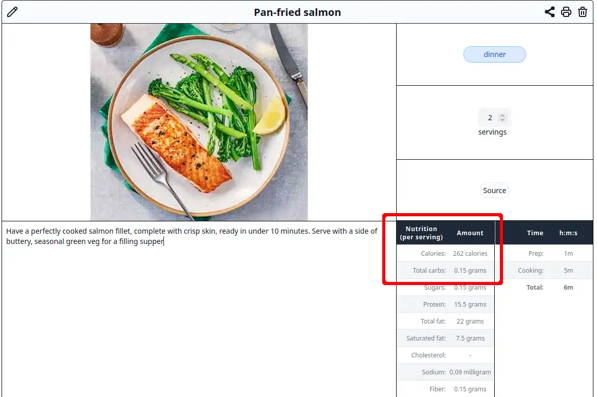

## v1.0.1 (release date TBD)

### Refresh scraper

The scraper module has been refreshed to keep it up-to-date. 
 
The `mob.co.uk` website has been removed because the recipe's script tag in the scraped HTML contains invalid JSON.
The `json` and `yaml` libraries unfortunately cannot decode the JSON.

The `nutritionbynathalie.com` website has been removed because it cannot be scraped anymore.

### Handle panic crash

Users could upload a file or a zip file and the server crashed. It is now handled.

### Nutrition per serving

The nutrition facts are now displayed on a per-serving basis when importing a website whose nutritional information is provided per serving rather than per 100g.

Under the hood, the `NutritionSchema.Servings` field must be a number represented as a string. If the field is empty, then the nutrition will be displayed per 100g. Per serving otherwise.
