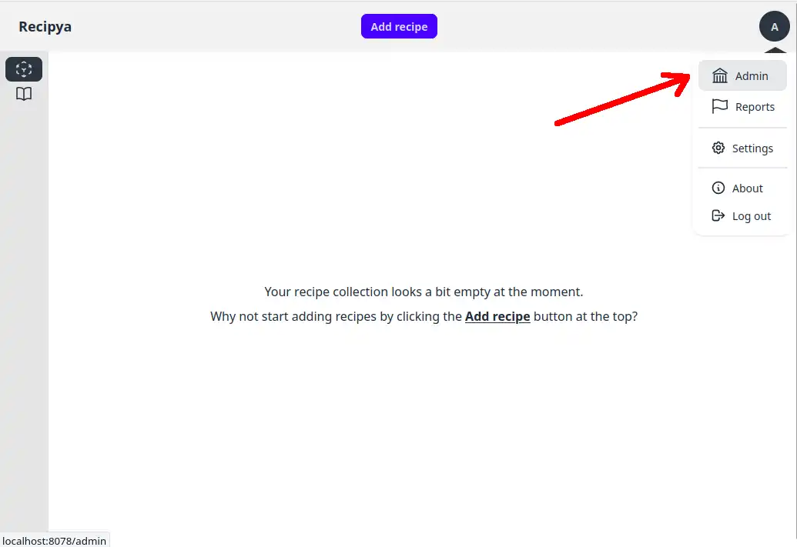
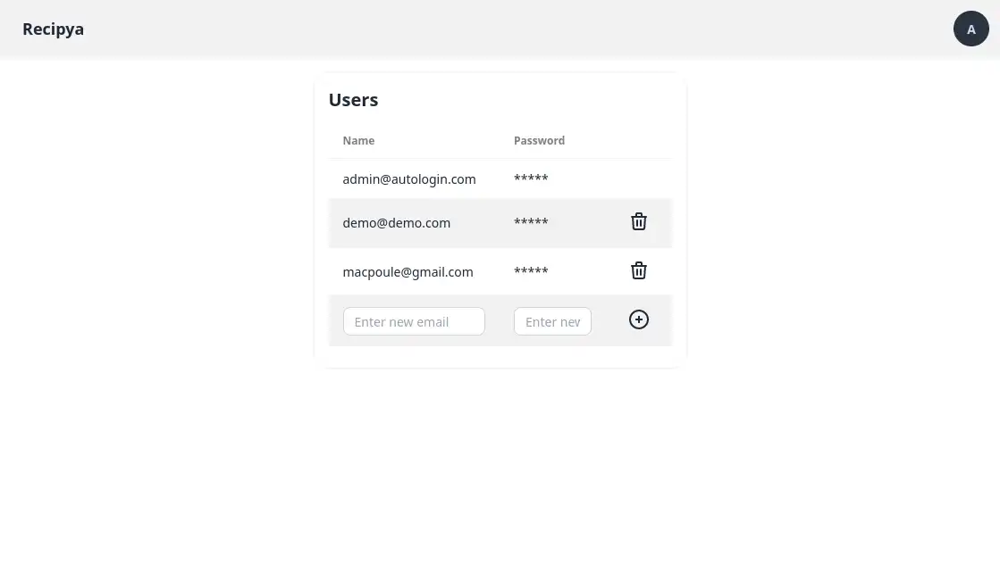

An administrator is defined as the initial user, typically the one who set up Recipya.
Only the administrator can access the admin page.

To access it, select the `Admin` option from the avatar menu.

You can add and delete users.

