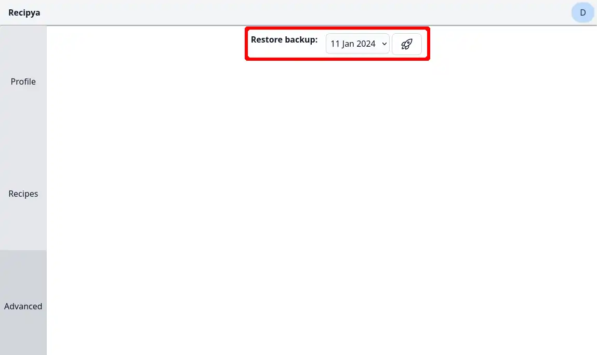

There are two types of data backups, each done once every three days.
A maximum of ten backups are stored for each type, resulting in the oldest backup 
being one month old.

### Global

A global backup is one which saves the state of the database and all the images.
It is stored under `path/to/recipya/data/backup/global/`.

Its structure is as follows:


    {{< filetree/folder name="recipya.{year-month-day}.zip" >}}
        
            
                
            
            
                {{< filetree/file name="{uuid_1}.jpg" >}}
                {{< filetree/file name="{uuid_2}.jpg" >}}
                {{< filetree/file name="{uuid_...}.jpg" >}}
                {{< filetree/file name="{uuid_N}.jpg" >}}
            
        
    


### User

A user backup is one which saves the state of a user's data. The following is saved:
- Recipes 
- Cookbooks
- Shared recipes
- Shared cookbooks

User backups are stored under `path/to/recipya/data/backup/users/{userID}`.

Its structure is as follows:

    {{< filetree/folder name="recipya.{year-month-day}.zip" >}}
        
            {{< filetree/file name="{uuid_1}.jpg" >}}
            {{< filetree/file name="{uuid_2}.jpg" >}}
            {{< filetree/file name="{uuid_...}.jpg" >}}
            {{< filetree/file name="{uuid_N}.jpg" >}}
        
        
        
        
    


## Restore

It is possible to restore a previous backup. The instructions on how to do so depends on its type.

### Global

Restoring a global backup is done only by the one who has access to the server.

1. Close the application
2. Navigate to `path/to/recipya/data/backup/global/`
3. Unzip the backup your wish to restore
4. Replace `path/to/recipya/data/databases/recipya.db` with the one from the unzipped backup
5. If applicable, delete `path/to/recipya/data/databases/recipya.db-shm` and `path/to/recipya/data/databases/recipya.db-wal`
6. Delete `path/to/recipya/data/images/`
7. Move the `images` folder from the unzipped backup to `path/to/recipya/data`
8. Start the application

### User

Restoring a user backup is done through the web application's user interface.

1. Access the settings page
2. Click the `Advanced` tab
3. Identify the **Restore backup** setting
4. Select the backup date
5. Click the rocket launch icon

