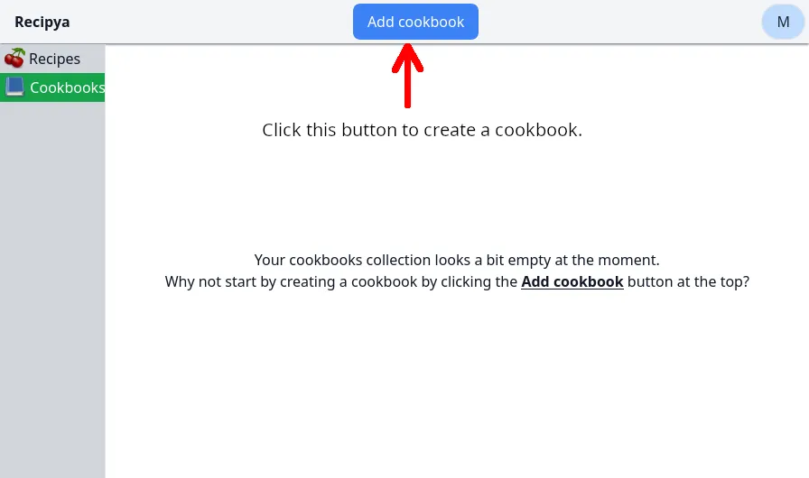

Click the *Add Cookbook* button from the cookbook feature tab to create a cookbook. 
You will be prompted for its title. 

The cookbook will then be displayed to you immediately. The following image shows two created cookbooks.

## Adding Recipes

Your cookbook is empty after creation. You can add recipes by searching for them in the search box.

After typing, press **Enter** or click the magnifying glass to submit your search request. The results will
appear below the search box. Queries are case-insensitive.

Finally, click the *Add* button on the recipes you want to the add to the cookbook.

