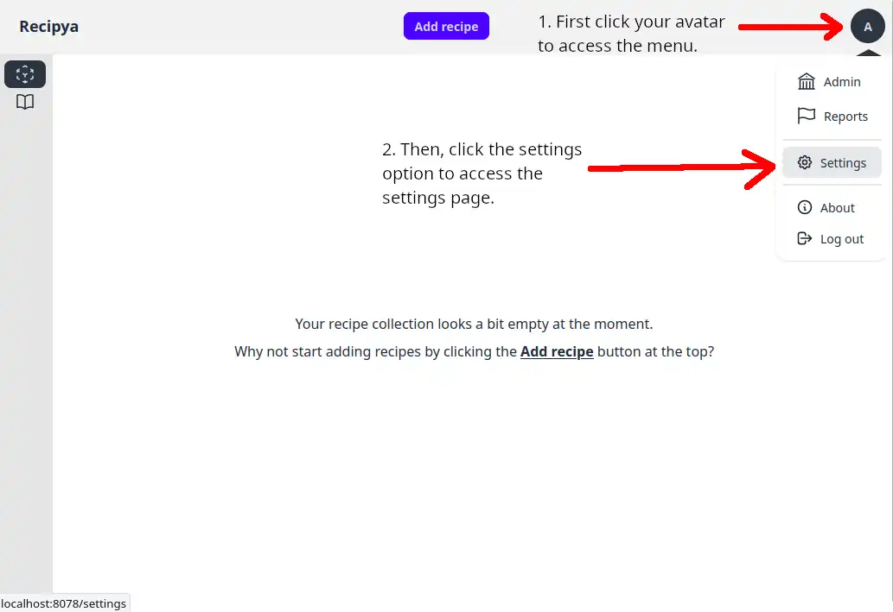
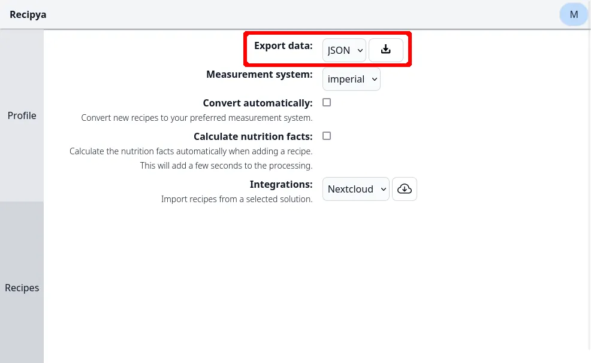

It is possible to download your data through the settings. To access them, click on your avatar in the top right
corner of any page within Recipya. Then, select the **Settings** option.

Finally, click the `Recipes` settings tab on the left. You can select the data you want to export from the dropdown
to the right of the `Export data` setting.

The dropdown is organized in groups. Let's go over them.

## Recipes

You can export your recipes in the following formats.
- JSON
- PDF

The JSON format exports all your recipes in a zipped archive organized in a hierarchical manner, with each folder 
containing a JSON file of the recipe and an existing image. The recipe file follows the 
[Recipe schema](https://schema.org/Recipe) standard.

The PDF format exports all your recipes in a zipped archive. Each file in the archive follows the naming 
convention `{recipe name}.pdf`.