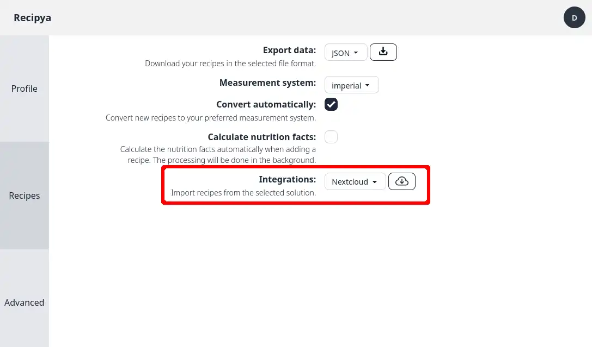
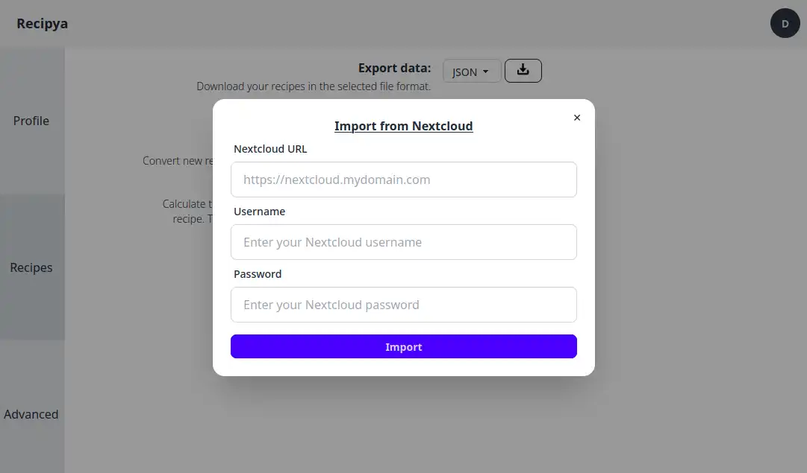

Recipya offers integrations with other recipe manager applications. You can access them from the **Recipes** side tab
in the settings.

## Compatibility

| Integration                                                    |        Import        |      Export      |
|----------------------------------------------------------------|:--------------------:|:----------------:|
| [MasterCook](https://www.mastercook.com)                       |  |  |
 | [Mealie](https://mealie.io)                                    |  |  |
| [Nextcloud Cookbook](https://apps.nextcloud.com/apps/cookbook) |  |  |
 | [Paprika](https://www.paprikaapp.com)                          |  |  |
| [Recipe Keeper](https://www.paprikaapp.com)                    |  |  |

## MasterCook

You can import your MasterCook recipes from the import button on the
[add recipe page](/guide/docs/features/recipes/add#import). You can either upload a single `.mxp` file or a zip archive
containing multiple `.mxp` files.

This [website](https://www.grassrootsrecipes.com/) contains endless MasterCook recipe collections for you to try.

## Mealie

Follow these steps to import your recipes from a Mealie instance:

1. Go to the **Integrations** setting and select the **Mealie** option.
2. Click the button adjacent to the menu of options.
3. In the dialog that appears, enter the URL and credentials of a Mealie instance.
4. Click the **Import** button.

Your recipes will be swiftly transferred from Mealie to Recipya.

## Nextcloud Cookbook

[Nextcloud Cookbook](https://github.com/nextcloud/cookbook) is an app for [Nextcloud](https://nextcloud.com/). 
Follow these steps to import your recipes from a Nextcloud Cookbook instance:

1. Go to the **Integrations** setting and select the **Nextcloud** option.
2. Click the button adjacent to the menu of options.
3. In the dialog that appears, enter the URL and credentials of your Nextcloud instance.
   
4. Click the **Import** button.

Your recipes will be swiftly transferred from Nextcloud Cookbook to Recipya.

## Paprika

Follow these steps to import recipes from Paprika.

1. [Export](https://www.paprikaapp.com/help/windows/#exportrecipes) your Paprika recipes in the `Paprika Recipe Format`.
2. Within Recipya, click the `Add recipe` button.
3. Click the `Import` button.
4. Select your `.paprikarecipes` file. You may also zip many `.paprikarecipes` together and select the resulting file.
5. Click `Submit`.

## Recipe Keeper

Follow these steps to import recipes from Recipe Keeper.

1. Access the settings within Recipe Keeper.
2. Go to the `Import/Export` tab.
3. Click the `Recipe Keeper .zip file` button at the top.
4. Save the file.
5. Within Recipya, click the `Add recipe` button.
6. Click the `Import` button.
7. Select the zip file you saved.
8. Click `Submit`.
