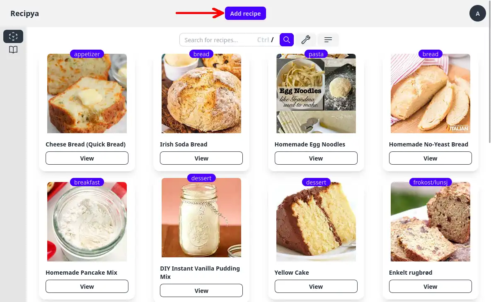
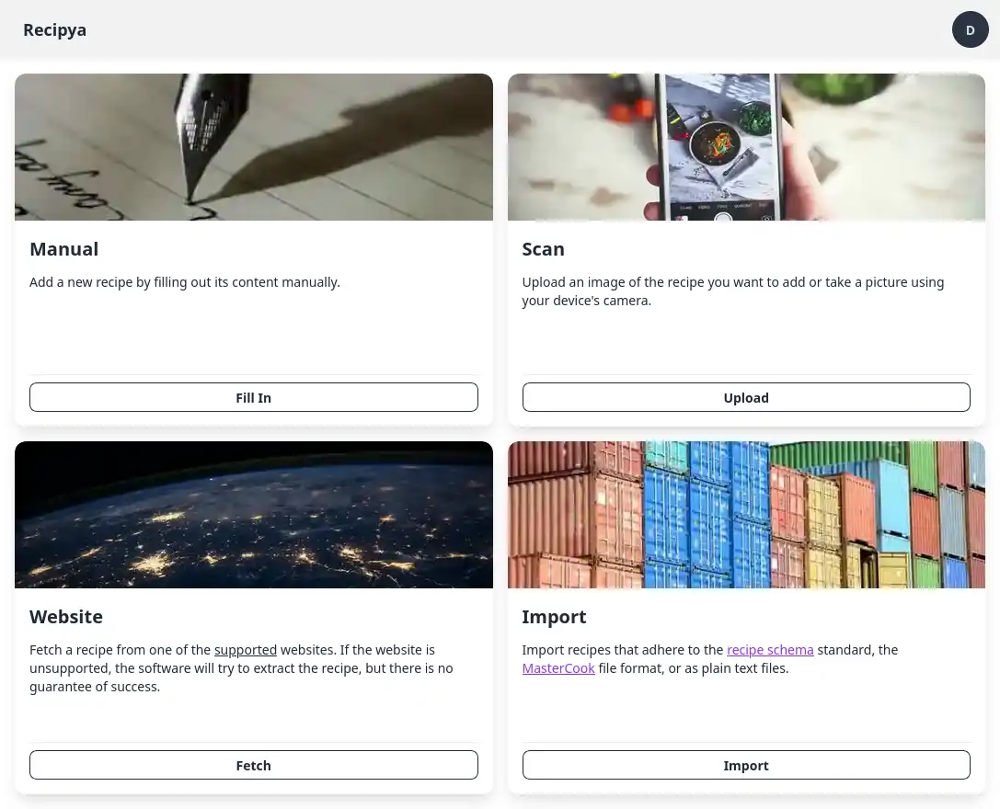
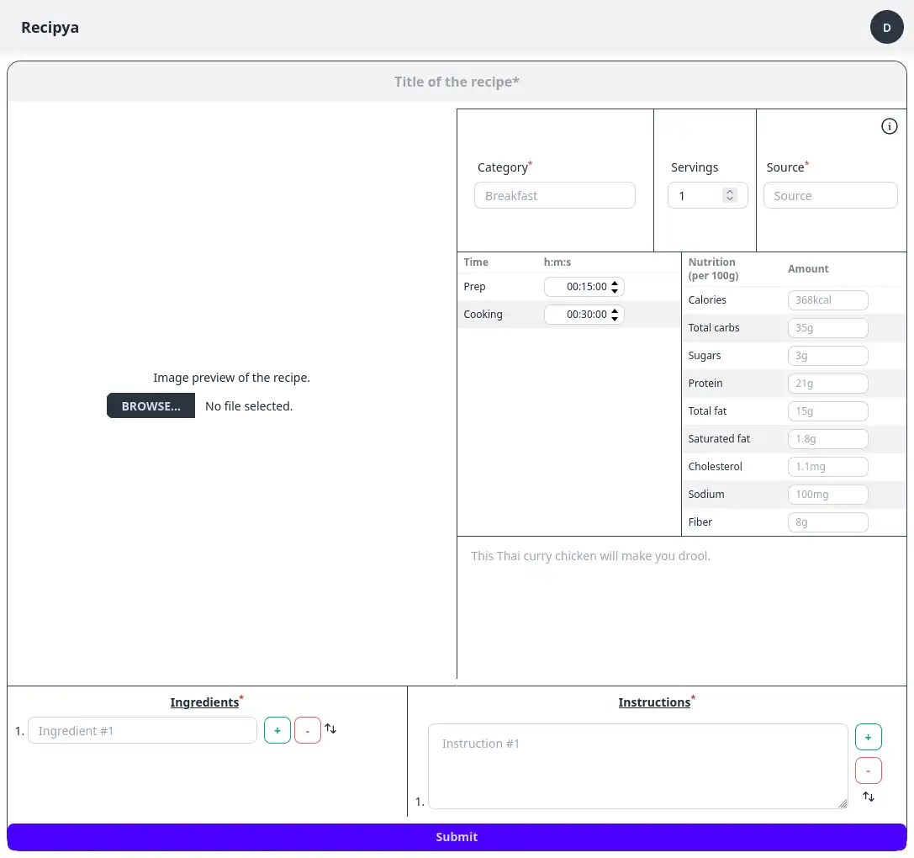
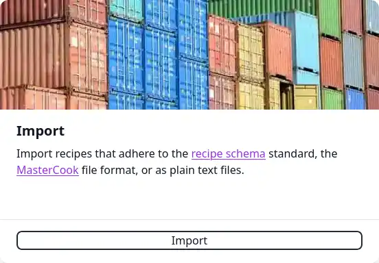

You can add a recipe by clicking the blue **Add Recipe** in the middle of the application bar.

## Adding Recipes

You will be presented with four different ways of adding a recipe to your collection.

- [Manual](#manual)
- [Scan](#scan)
- [Website](#website)
- [Import](#import)

### Manual

The simplest method of inputting a recipe involves completing a form that outlines your dish.
Mandatory fields are indicated with an asterisk (*).

You might find these shortcuts useful if you are filling the form from your computer.

| Shortcut     | How to enable                     | Result              |
|--------------|-----------------------------------|---------------------|
| Enter        | Focus on an ingredient text input | Add ingredient row  |
| Ctrl + Enter | Focus on an instruction text area | Add instruction row |

You can also reorder the ingredients and the instructions by dragging the arrow vertically.

### Scan

You can upload an image or a scan of a handwritten or printed recipe to add it to your collection. 
This option is useful for digitizing your and your family's paper recipes.

To do so, click the *Upload* button and select an image in your computer.

You can upload files in the following formats:
- Images (JPEG/JPG, PNG, BMP, HEIF)
- PDF
- TIFF


You must have an [Azure AI Document Intelligence](/guide/docs/installation/integrations#azure-AI Document Intelligence) instance to use this feature.


### Website

You can import any recipe from the supported websites. To do so, click the **Fetch** button, 
paste the recipe's URL or URLs, each on a new line, and click *Submit*. A notification will 
appear when the operation finished. 

Its action button performs an action based on the outcome. When you imported one URL and the 
operation succeeds, the action will redirect you to the recipe. Otherwise, you will be redirected
to the latest report.

To view all supported websites, please click on the <ins>supported</ins> word. You can scrape a 
website not in the supported list, but recipe extraction may fail. If it does, you can request 
support for the website by clicking the button that appears.

### Import

You can import recipes in the following formats:
- `.json`: If they adhere to the [Recipe schema](https://schema.org/Recipe) standard
- `.mxp`: Exported recipes from [MasterCook](https://www.mastercook.com)
- `.paprikarecipes`: Exported recipes from [Paprika](https://www.paprikaapp.com) in the `Paprika Recipe Format`
- `.txt`
- `.zip`

You can upload either a single file or a zip archive containing multiple recipes. The recipes in a zip file may be 
organized by folder. Each folder may contain the `.json` recipe file and an image file. All other files in a folder 
will be ignored during processing. Here is an [example](https://sea.musicavis.ca/f/683b9b9a7cc84e1bac0c/?dl=1) of 
how such zip may look like.

You may also upload exported recipes from the following applications:
- AccuChef
- ChefTap
- Crouton
- Easy Recipe Deluxe
- Kalorio
- MasterCook
- Mealie
- Paprika
- Recipe Keeper
- RecipeSage
- Saffron
- Tandoor

#### AccuChef

Follow these steps to import your recipes from AccuChef:

1. Export your recipes in `AccuChef`.
2. Within Recipya, click the `Add recipe` button.
3. Click the `Import` button.
4. Select the exported `.txt` file.
5. Click `Submit`.

#### ChefTap

Follow these steps to import your recipes from ChefTap:

1. From the `ChefTap` mobile application, export your recipes in the text format.
2. Within Recipya, click the `Add recipe` button.
3. Click the `Import` button.
4. Select the exported `.zip` file.
5. Click `Submit`.

#### Crouton

Follow these steps to import your recipes from Crouton:

1. Export your recipes in `Crouton`.
2. Within Recipya, click the `Add recipe` button.
3. Click the `Import` button.
4. Select the exported `.zip` file.
5. Click `Submit`.

#### Easy Recipe Deluxe

Follow these steps to import your recipes from Easy Recipe Deluxe:

1. Export your recipes in `Easy Recipe Deluxe`: Publish -> Text.
2. Within Recipya, click the `Add recipe` button.
3. Click the `Import` button.
4. Select the exported `.txt` file.
5. Click `Submit`.

#### Kalorio

Follow these steps to import recipes from Kalorio.

1. Export your [Kalorio](https://www.kalorio.de/index.php?Mod=Ka&Cap=EI&SCa=kal_export) recipes in the `CookML` format.
2. Within Recipya, click the `Add recipe` button.
3. Click the `Import` button.
4. Select the exported file.
5. Click `Submit`.

#### Mealie

Follow these steps to import your recipes from a Mealie instance:

1. Go to the **Integrations** setting and select the **Mealie** option.
2. Click the button adjacent to the menu of options.
3. In the dialog that appears, enter the URL and credentials of a Mealie instance.
4. Click the **Import** button.

#### Paprika

Follow these steps to import recipes from Paprika.

1. [Export](https://www.paprikaapp.com/help/windows/#exportrecipes) your Paprika recipes in the `Paprika Recipe Format`.
2. Within Recipya, click the `Add recipe` button.
3. Click the `Import` button.
4. Select your `.paprikarecipes` file. You may also zip many `.paprikarecipes` together and select the resulting file.
5. Click `Submit`.

#### Recipe Keeper

Follow these steps to import recipes from Recipe Keeper.

1. Access the settings within Recipe Keeper.
2. Go to the `Import/Export` tab.
3. Click the `Recipe Keeper .zip file` button at the top.
4. Save the file.
5. Within Recipya, click the `Add recipe` button.
6. Click the `Import` button.
7. Select the zip file you saved.
8. Click `Submit`.

#### RecipeSage

Follow these steps to import recipes from RecipeSage.

1. Export your [RecipeSage](https://docs.recipesage.com/docs/tutorials/settings/export/) recipes in the `JSON-LD` format.
2. Within Recipya, click the `Add recipe` button.
3. Click the `Import` button.
4. Select the exported file.
5. Click `Submit`.

#### Saffron

Follow these steps to import recipes from Saffron.

1. Export your [Saffron](https://www.mysaffronapp.com/account) recipes.
2. Within Recipya, click the `Add recipe` button.
3. Click the `Import` button.
4. Select the exported `.zip` file.
5. Click `Submit`.

#### Tandoor

Follow these steps to import your recipes from a Tandoor instance:

1. Go to the **Integrations** setting and select the **Tandoor** option.
2. Click the adjacent button.
3. In the dialog that appears, enter the URL and credentials of a Tandoor instance.
4. Click the **Import** button.

#### Recipya Bookmarklet

The Recipya bookmarklet allows a user to run a JavaScript snippet from their browser that extracts a recipe from a webpage.

It's for websites that both:
- can't be scraped via a server request, i.e. have something like captcha or bot detection
- that have json+ld recipe script snippets on their page

To get the bookmarklet:
1. Access `/recipes/add`
2. Bookmark the `Recipya Bookmarklet` link in the `Import` card.

To use it:
1. Open a recipe webpage, e.g. [double banana nut bread](https://www.allrecipes.com/recipe/231961/double-banana-nut-bread/)
2. Click the bookmarklet
3. A JSON file is downloaded when it succeeds.

You can then import the extracted recipe from `Add recipe -> Import`.

