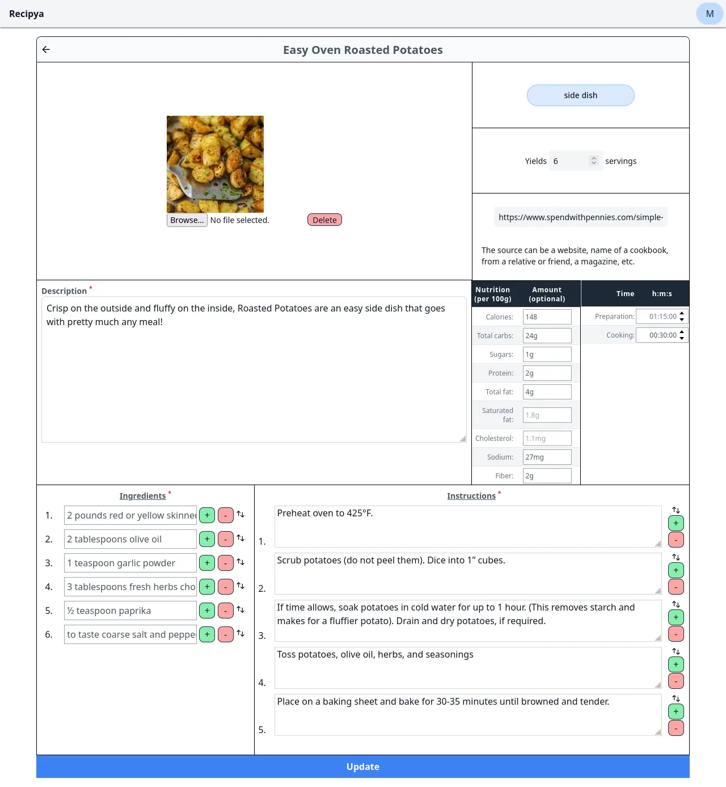

To edit a recipe in your collection, you first must [view](/guide/docs/features/recipes/view) a recipe.
Then, click the pencil icon to the left of the recipe's title. 

You will enter the edit mode, which allows you to edit any of the recipe's information. 
Press the blue **Update** button at the bottom of the form to save your changes. 

