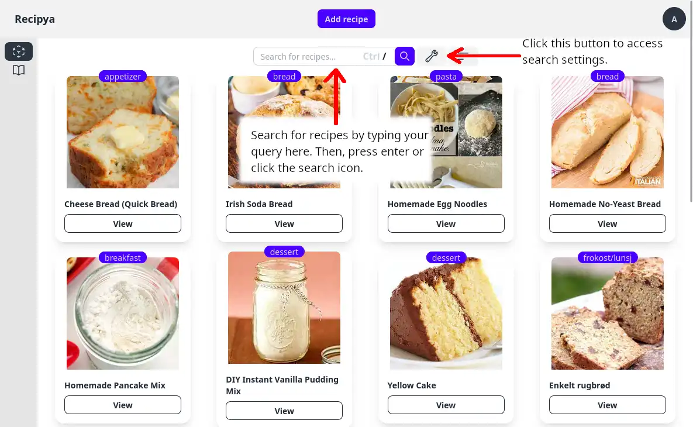
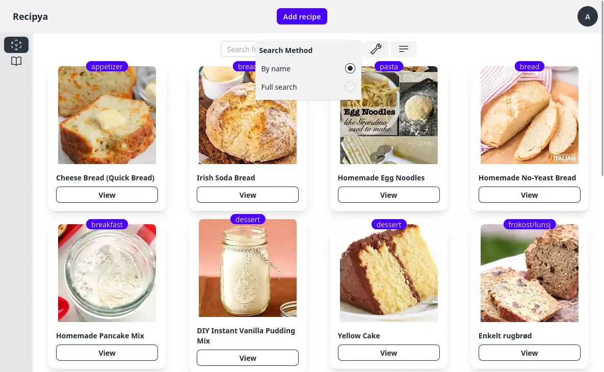

You can search for recipes from the search text box below the add recipes button of the recipes view page.
Type your keywords delimited by either a space, comma or both. Then press the enter key to fire the search.

## Search Settings

Click on the wrench icon to the right of the search bar to access the settings.

### Search Modes

You can choose how the search is performed. The default is **Full search**.

#### By name 

Your query will search the title field of the all recipes belonging to you and return all
recipes that include the search term or terms.

#### Full search

Your query will search the following fields of all recipes belonging to you:
- Title
- Description
- Category
- Ingredients
- Instructions
- Keywords
- Source

The results will be ranked based on their relevance to the search terms.

