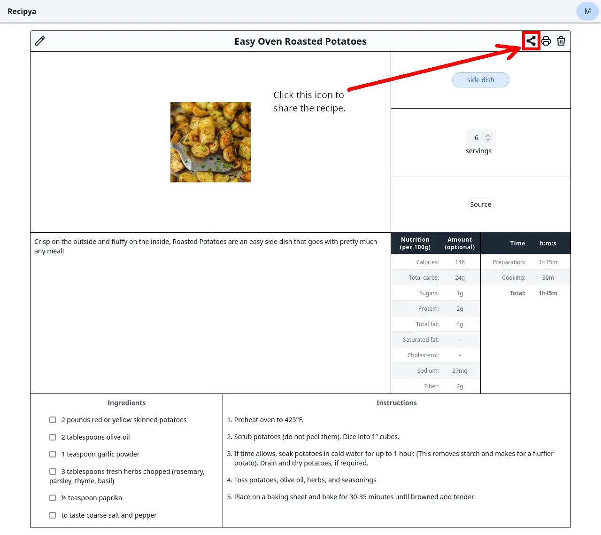

A recipe can be shared to anyone who has the share link.

To generate the link, you first must [view a recipe](/guide/docs/features/recipes/view). Then, click the share icon to the right of the
recipe's title. 

The link will be generated and displayed for you to copy, ready to be sent to your friends.
Its naming convention is `{host}/r/{UUID}`. The UUID will prevent any clash with someone else's 
shared recipe because no two UUID is the same.

