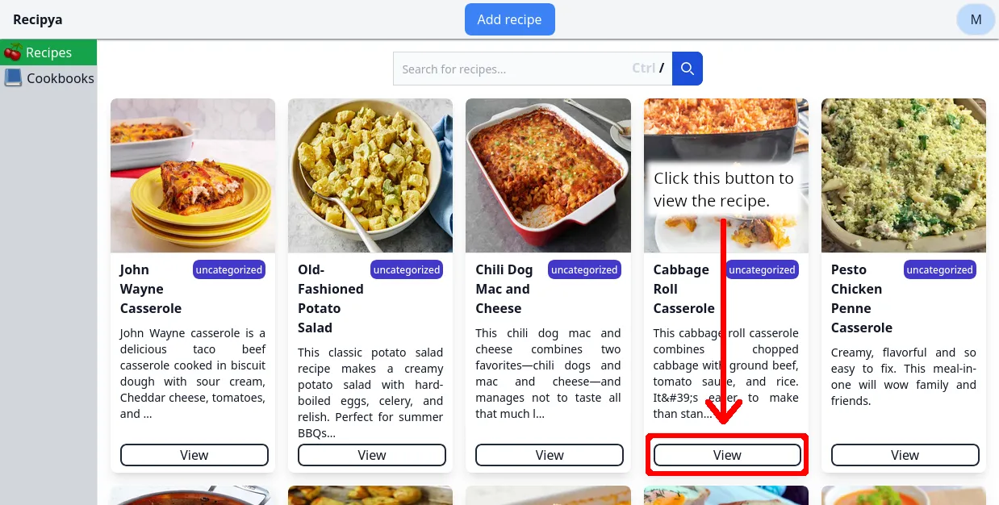
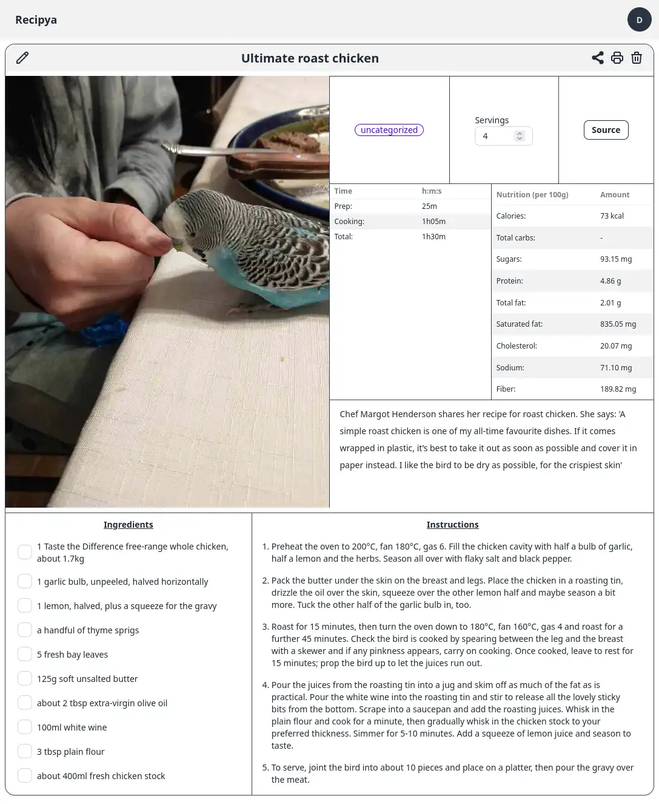
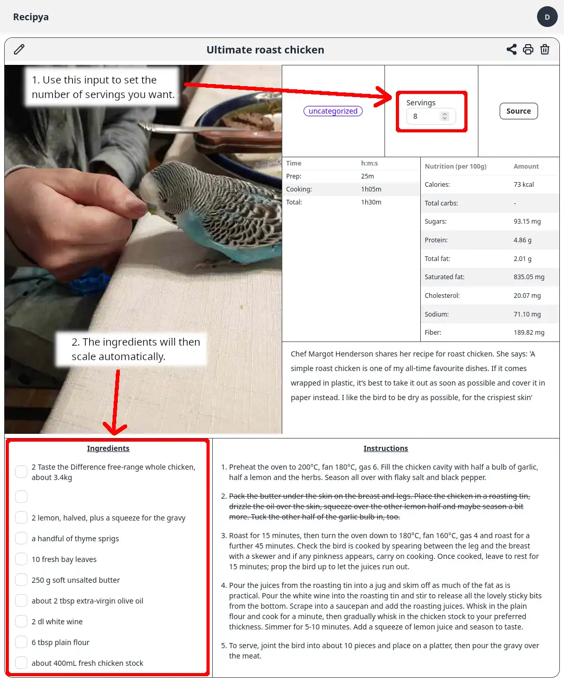

To view a recipe, you first need to view your collection of recipes.

You will then be presented with the recipe's information for you
to follow while cooking. 


You can click or tap on the ingredients
and instructions to cross them out.


## Scaling

To scale a recipe, use the number input in the yield square to select the number of servings you want to make.

If you want to make more servings, enter a higher number.
If you want to make fewer servings, enter a lower number.

For example, the recipe above yields 6 servings. To double the recipe, set the number of servings to 12.
The recipe will then be automatically scaled to make 12 servings of oven roasted potatoes, as shown below.


The scaling feature currently only scales ingredients, leaving instructions untouched. This
means that if an instruction mentions a specific amount of an ingredient, then that amount will
not be scaled. This limitation will be addressed in the future.


## Videos

It is possible to attach videos to recipes. Every video will be converted to the
[WebM](https://en.wikipedia.org/wiki/WebM) audiovisual media file format using [FFmpeg](https://en.wikipedia.org/wiki/FFmpeg).

FFmpeg is included in the Docker build. 

Otherwise:
- If you use Windows, the setup will attempt to install it using [winget](https://learn.microsoft.com/en-us/windows/package-manager/winget/).
- If you use Linux, you should install it yourself by executing the appropriate command for your distro.
- If you use macOS, you should install it yourself by executing `brew install ffmpeg`.

Video conversion might be slow. Therefore, the video might not be immediately available for viewing after you attach it to a recipe.

Recipes from websites sometimes include videos, e.g. [this one](https://www.allrecipes.com/recipe/10813/best-chocolate-chip-cookies/).
They will be extracted automatically and will be displayed in the image carousel. They are not downloaded locally nor
are they converted to WebM using FFmpeg. They are kept in their original format.