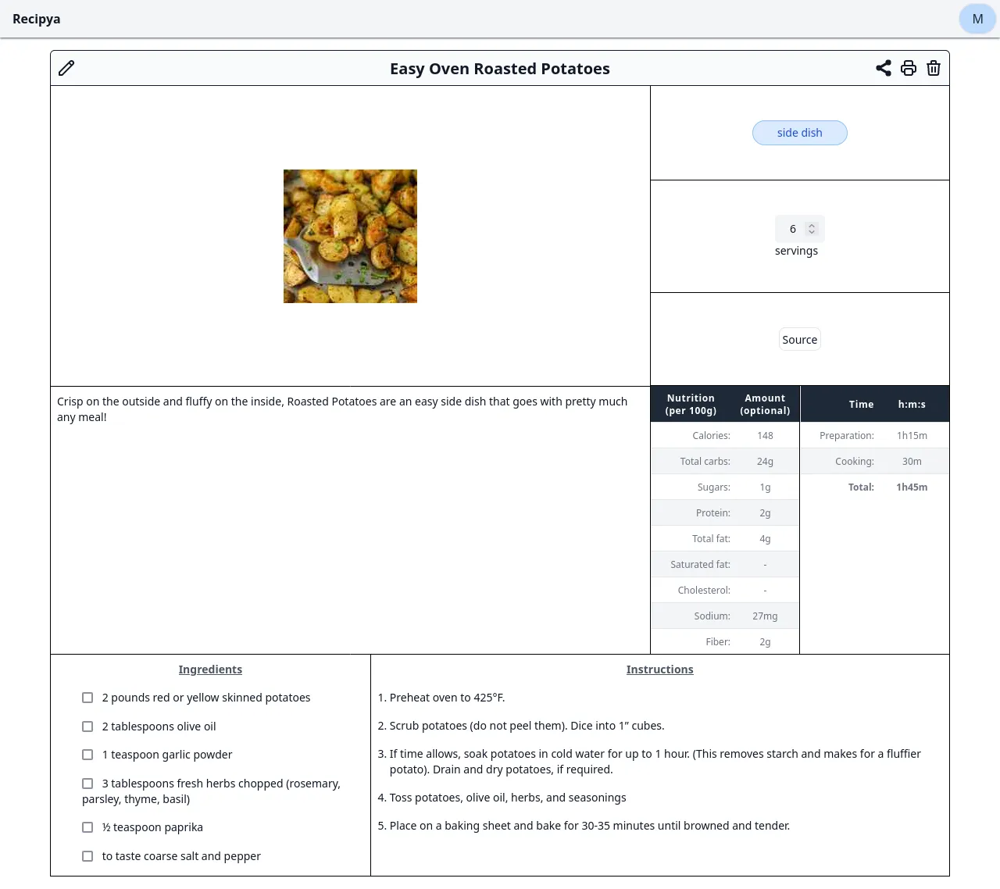

To view a recipe, you first need to view your collection of recipes.

You will then be presented with the recipe's information for you
to follow while cooking. 


You can click or tap on the ingredients
and instructions to cross them out.


## Scaling

To scale a recipe, use the number input in the yield square to select the number of servings you want to make.

If you want to make more servings, enter a higher number.
If you want to make fewer servings, enter a lower number.

For example, the recipe above yields 6 servings. To double the recipe, set the number of servings to 12.
The recipe will then be automatically scaled to make 12 servings of oven roasted potatoes, as shown below.


The scaling feature currently only scales ingredients, leaving instructions untouched. This
means that if an instruction mentions a specific amount of an ingredient, then that amount will
not be scaled. This limitation will be addressed in the future.

