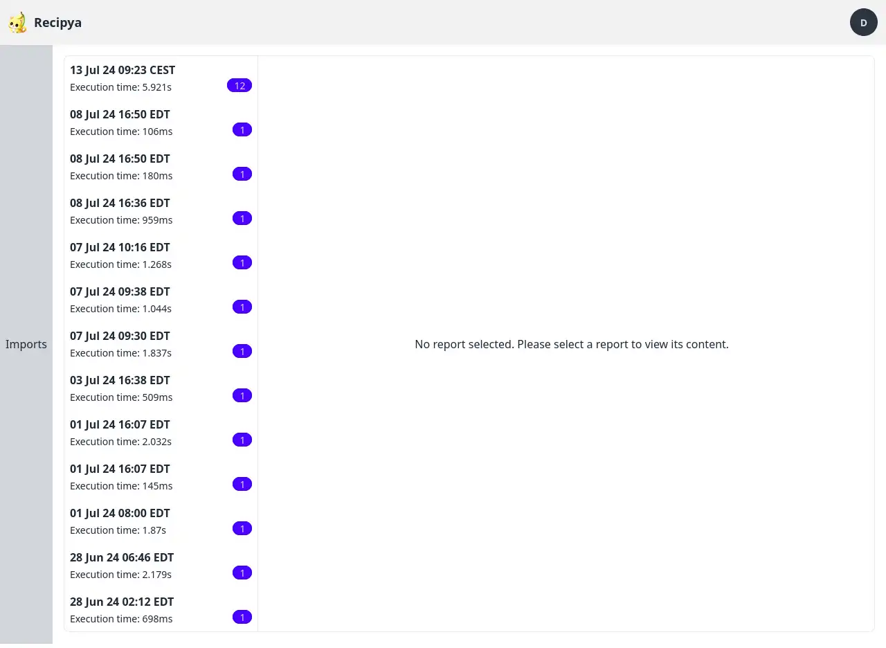
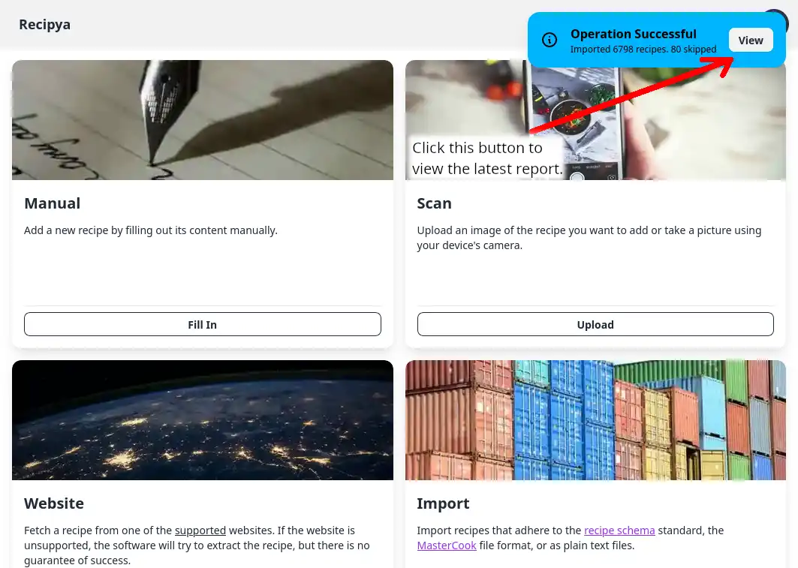
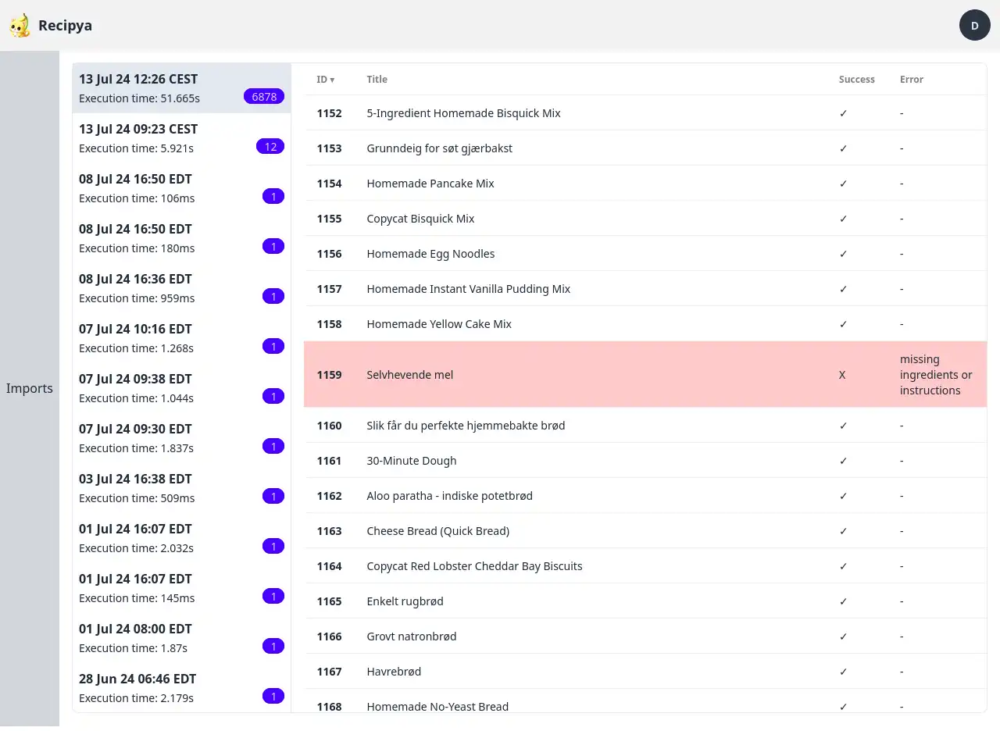
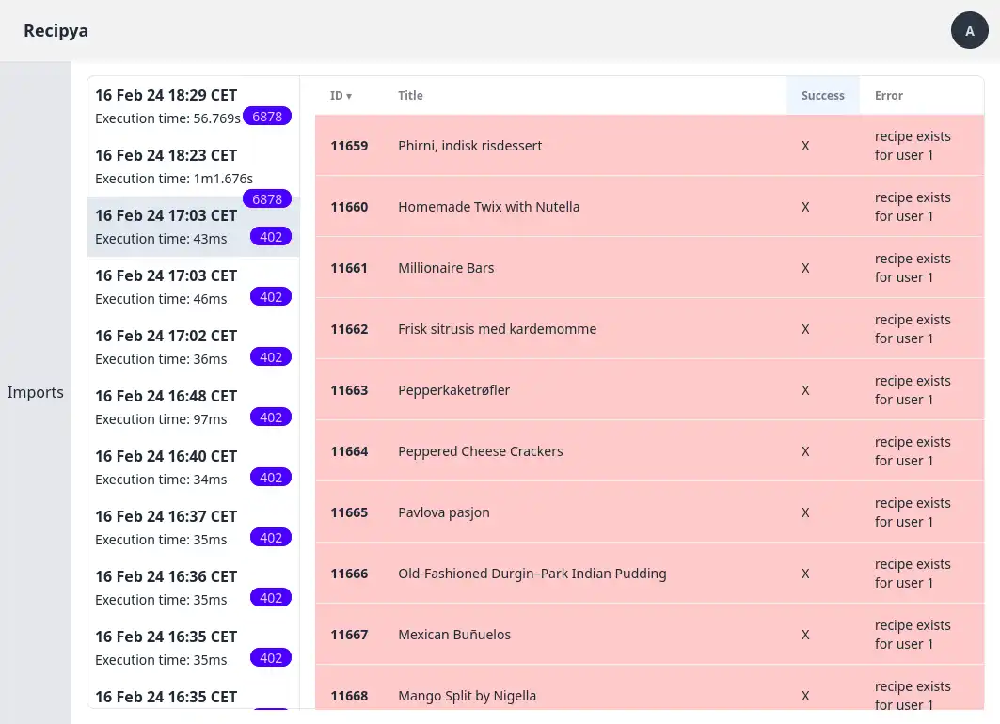

The reports page allows you to view operation logs after importing recipes. 

## Access

There are two ways to access the page.

### Avatar Menu

The reports page will list all the reports on the left pane. No report will be selected initially.

### After Imports

The reports page will also list all the reports in the left pane. The latest report will be selected.

## Structure

The reports page is structured into two viewing panes. The left one lists all available reports for the report type, whereas the right 
pane displays the content of the selected report. The report type is selected from the sidebar next to the list of reports. 

You can choose from the following types:
- **Import**: An import report is one generated after importing recipes.

### Left Pane

The left pane lists all reports of the selected type. Each item displays the following:
- **Time stamp**: The title of the item. Represents when report was generated.
- **Execution time**: The time it took to import the recipes.
- **Log count**: Found to the right of the execution time. Represents the number of entries associated with the report.

### Right Pane

The right pane displays all log entries associated with the selected report in a table. You can sort any column, either descending or 
ascending, by clicking on its header.

Failed operations will be highlighted in red.

