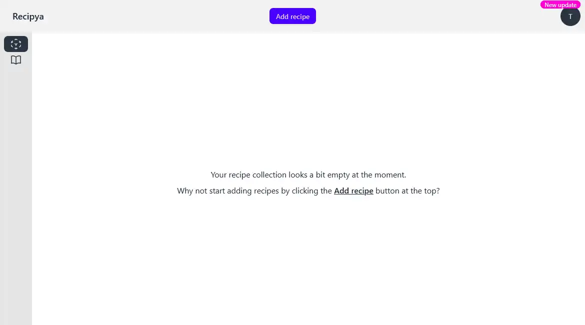
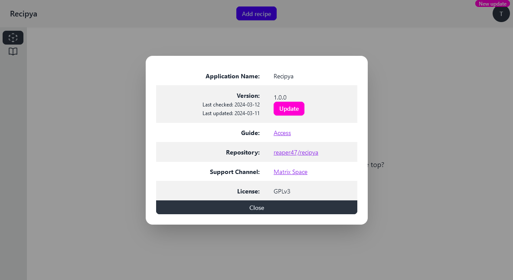

You can update the application from within the web application once update is available. Your data will be backed 
up under `/path/to/recipya/backup/global` before the update in case something goes south. The update checker is 
run once a week.

You will first notice a `New update` badge over your avatar.

Click on this badge and select `About`. Finally, click the `Update` button.

On success, the application will reload automatically after five secconds.

