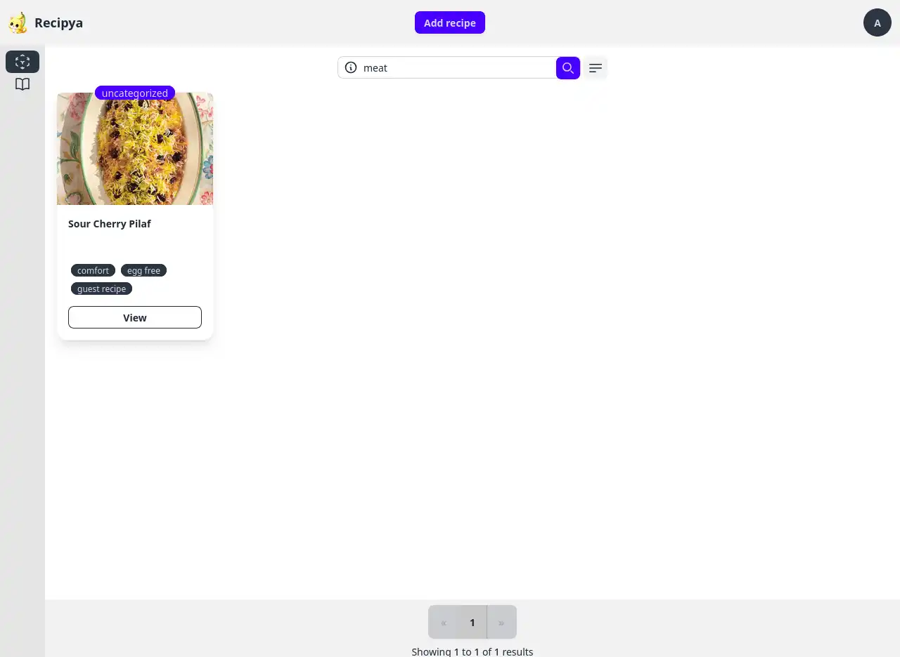
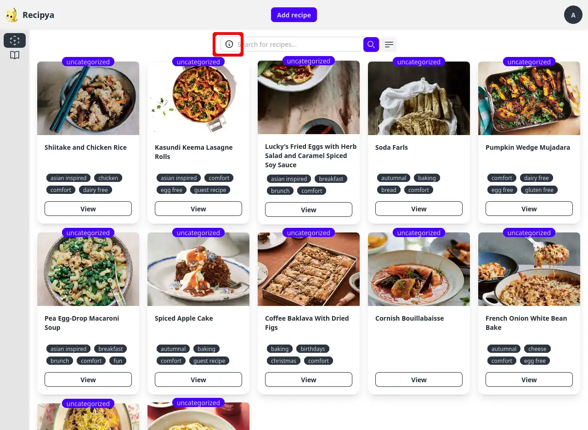

You can search for recipes from the search text box below the add recipes button of the recipes view page.
Type your keywords delimited by either a space, comma or both. Then press the enter key to fire the search.

## Basic Search

The basic search is one where the user types something in the search box without using any
of the advanced search concepts.

The default search mode is __Full search__. In other words, your query will search the following fields of all 
recipes belonging to you:
- Title
- Description
- Category
- Ingredients
- Instructions
- Keywords
- Source
- Tools

The results will be ranked based on their relevance to the search terms.

## Advanced Search

The advanced search feature lets you tailor the search query to specific requirements. It is similar to using advanced
search features in google. For example, searching for `magnetic declination site:.edu` in Google will yield results 
containing the terms `magnetic declination` for websites of the `.edu` top-level domain.

The following table provide examples of how to perform various searches. You may combine any of the searches in any order.

| Search                       | Example                                                |
|------------------------------|--------------------------------------------------------|
| Any field                    | big green squash                                       |
| By category                  | cat:dinner                                             |
| Multiple categories          | cat:breakfast,dinner                                   |
| Subcategory                  | cat:beverages:cocktails                                |
| Any field of category        | chicken cat:dinner                                     |
| By name                      | name:chicken kyiv                                      |
| By name and category         | name:chicken kyiv cat:lunch                            |
| Any field, name and category | best name:chicken kyiv cat:lunch                       |
| By description               | desc:tender savory stacked                             |
| Multiple descriptions        | desc:tender savory stacked,juicy crispy pieces chicken |
| By cuisine                   | cuisine:ukrainian                                      |
| Multiple cuisines            | cuisine:ukrainian,japanese                             |
| By ingredient                | ing:onions                                             |
| Multiple ingredients         | ing:olive oil,thyme,butter                             |
| By instruction               | ins:preheat oven 350                                   |
| Multiple instructions        | ins:preheat oven 350,melt butter                       |
| By keyword                   | tag:biscuits                                           |
| Multiple keywords            | tag:biscuits,mardi gras                                |
| By Tool                      | tool:frying pan                                        |
| Multiple tools               | tool:frying pan,wok                                    |
| By source                    | src:allrecipes.com                                     |
| Multiple sources             | src:allrecipes.com,tasteofhome.com                     |

### Help

You may access the advanced search help dialog by clicking the info button to the far left of the search bar.

