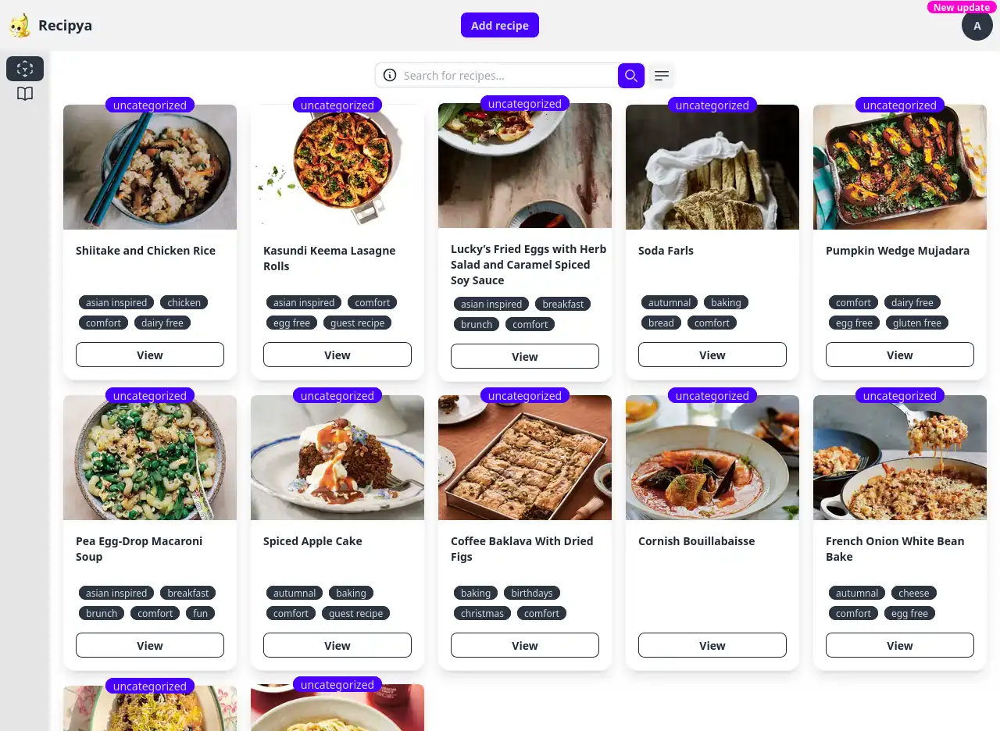

You can update the application from within the web application once an update becomes available. Your data will be backed 
up under `/path/to/recipya/Backup/global` before the update in case something goes south. The update checker is 
run once every three days.

You will first notice a pink `New update` badge over your avatar.

Click on your avatar, access the settings dialog, and select the `About` tab.
Finally, click the `Update` button.

On success, the application will reload automatically after five seconds.

