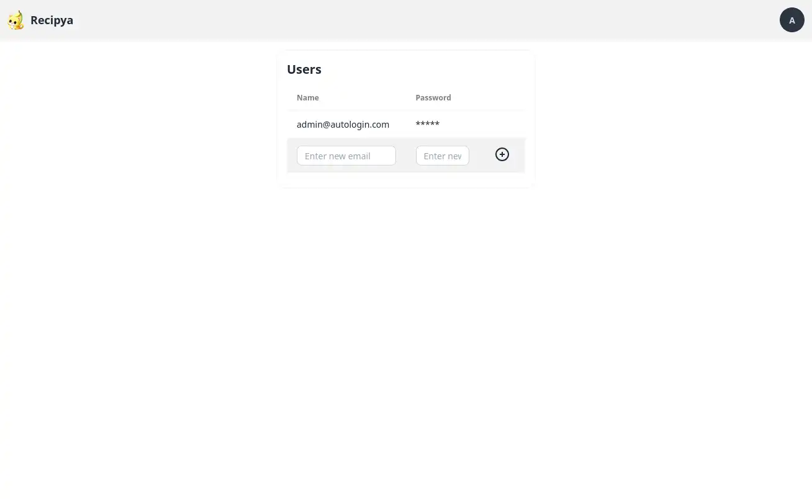

Un administrateur est défini comme l'utilisateur initial, généralement celui qui a configuré Recipya.
Seul l'administrateur peut accéder à la page d'administration.

Pour y accéder, sélectionnez l'option « Admin » dans le menu de l'avatar.

Vous pouvez ajouter et supprimer des utilisateurs.

