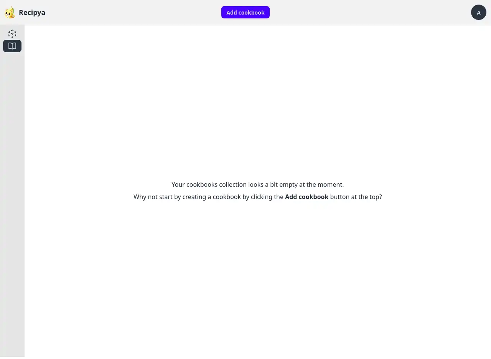
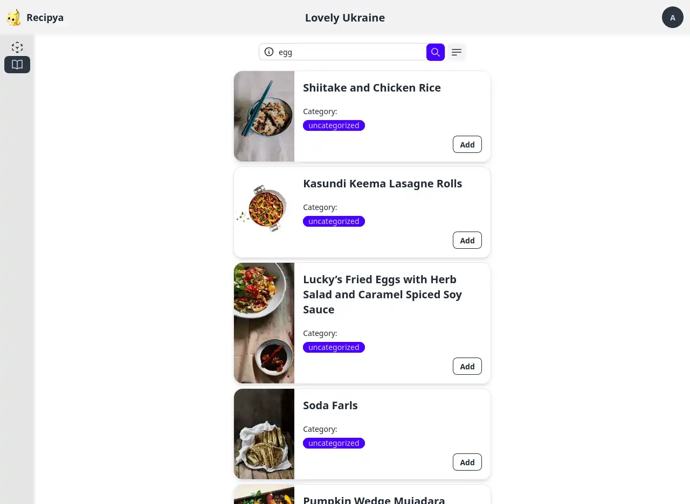

Cliquez sur le bouton *Ajouter un livre de recettes* dans l'onglet de la fonction Livre de recettes pour créer un livre de recettes. Vous serez invité à saisir son titre.

Le livre de recettes s'affiche alors immédiatement. L'image suivante montre deux livres de recettes créés.

## Ajout de recettes

Votre livre de recettes est vide après sa création. Vous pouvez ajouter des recettes en les recherchant dans la zone de recherche.

Après avoir tapé, appuyez sur **Entrée** ou cliquez sur la loupe pour soumettre votre demande de recherche. Les résultats
s'afficheront sous la zone de recherche. Les requêtes ne sont pas sensibles à la casse.

Enfin, cliquez sur le bouton *Ajouter* sur les recettes que vous souhaitez ajouter au livre de cuisine.

