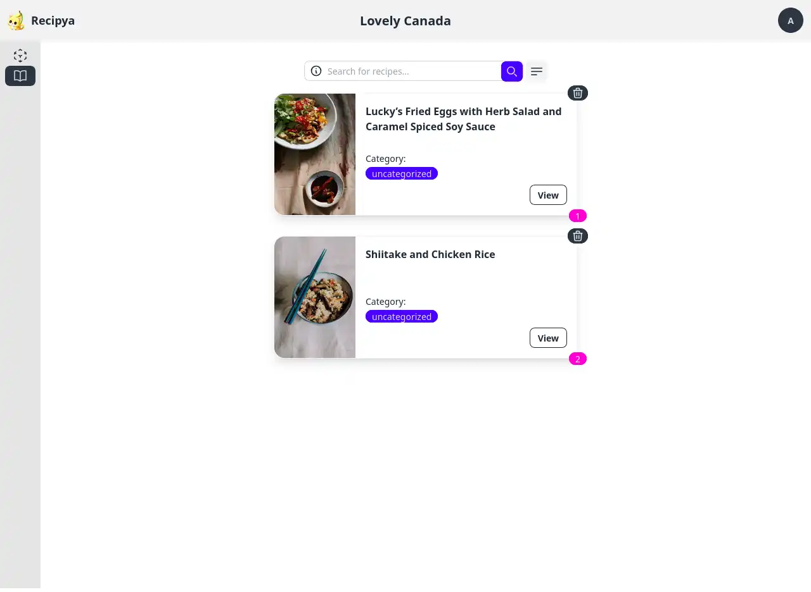

Vous pouvez mettre à jour l'image d'un livre de recettes ainsi que réorganiser les recettes.

## Mettre à jour l'image

Cliquez sur l'image d'un livre de recettes pour la mettre à jour. 
Vous serez alors invité à utiliser le sélecteur de fichiers du système d'exploitation pour sélectionner une image.

L'image du livre de recettes sera mise à jour immédiatement après la sélection du fichier.

## Réorganiser les recettes

Vous pouvez réorganiser les recettes d'un livre de cuisine. Cela est utile lorsque vous souhaitez que les recettes
s'enchaînent d'une certaine manière. Par exemple, vous pouvez vouloir que toutes les entrées apparaissent en premier, puis les déjeuners et
enfin les dîners.

Pour les réorganiser, ouvrez d'abord un livre de cuisine. Dans l'image suivante, nous voulons échanger la position de la
première recette avec celle de la dernière.

Ensuite, faites glisser le numéro de page de la recette que vous souhaitez mettre à jour. Une fois à la position souhaitée,
relâchez la souris. Les pages seront immédiatement mises à jour.

## Changer de mode d'affichage

Les livres de recettes peuvent être affichés dans les modes suivants :
- Grille
- Liste

Pour les afficher sous forme de grille, cliquez sur l'icône de grille sous votre avatar.

Pour les afficher sous forme de liste, cliquez sur l’icône de liste.

