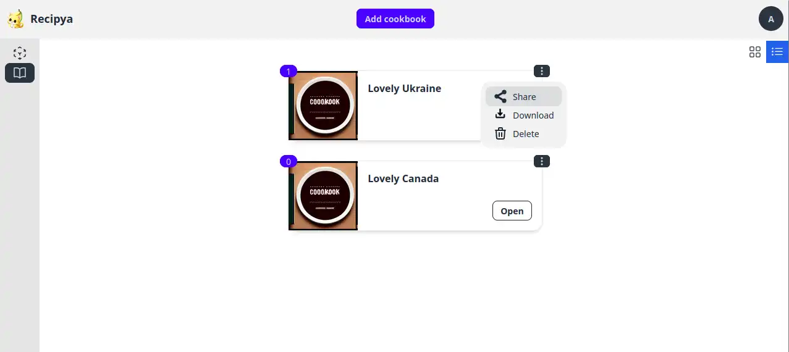
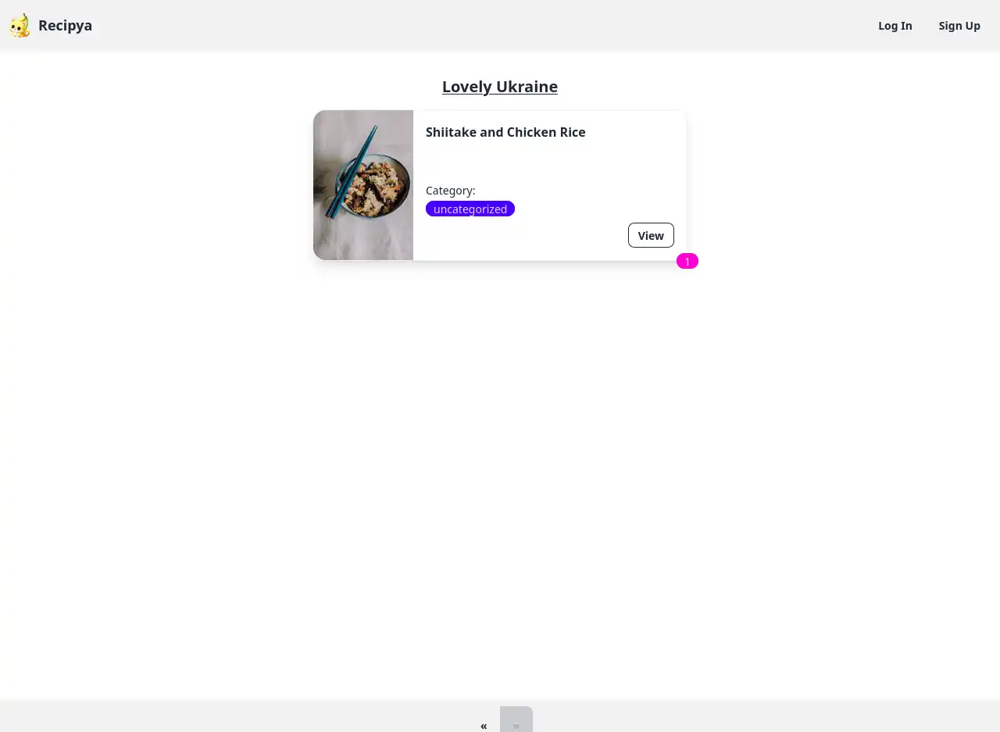

Vous pouvez partager un livre de recettes avec votre famille et vos amis. Pour ce faire, vous devez d'abord générer le lien de partage du livre
de recettes en cliquant sur l'option de sous-menu **Partager** dans le menu de l'icône à trois points.

Le lien vous sera alors affiché, prêt à être envoyé à votre famille et à vos amis.

Toute personne qui ouvre ce lien verra les recettes que vous avez ajoutées au livre de cuisine que vous avez partagé.
Toute recette peut alors être consultée sans avoir à se connecter.

