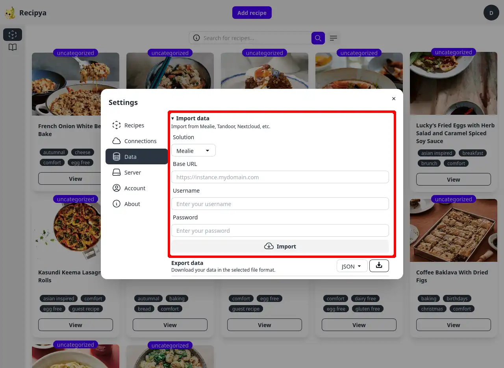

Recipya propose des intégrations d'importation de données avec d'autres applications de gestion de recettes.

Vous pouvez importer vos recettes depuis Nextcloud Cookbook, Mealie et Tandoor en utilisant leurs API respectives depuis l'onglet
`Data` dans les paramètres. Il vous suffit de sélectionner la solution à partir de laquelle vous souhaitez importer, ainsi que son 
URL de base et vos identifiants.

Comme pour les autres applications, vous pouvez le faire depuis la fonctionnalité [Add recipe → Import](/guide/fr/docs/features/recipes/add/#import).

## Compatibilité

| Intégration                                                            |       Importer       |       Emplacement        |  
|------------------------------------------------------------------------|:--------------------:|:------------------------:|
 | [AccuChef](https://www.accuchef.com)                                   |  |   Add recipe → Import    |
| [ChefTap](https://cheftap.com)                                         |  |   Add recipe → Import    |
| [Crouton](https://crouton.app)                                         |  |   Add recipe → Import    |
| [Easy Recipe Deluxe](https://easy-recipe-deluxe.software.informer.com) |  |   Add recipe → Import    |
 | [Kalorio](https://www.kalorio.de)                                      |  |   Add recipe → Import    |
| [MasterCook](https://www.mastercook.com)                               |  |   Add recipe → Import    |
 | [Mealie](https://mealie.io)                                            |  | Settings → Data → Import |
| [Nextcloud Cookbook](https://apps.nextcloud.com/apps/cookbook)         |  | Settings → Data → Import |
 | [Paprika](https://www.paprikaapp.com)                                  |  |   Add recipe → Import    |
| [Recipe Keeper](https://www.paprikaapp.com)                            |  |   Add recipe → Import    |
| [RecipeSage](https://recipesage.com/#/welcome)                         |  |   Add recipe → Import    |
 | [Saffron](https://www.mysaffronapp.com)                                |  |   Add recipe → Import    |
 | [Tandoor](https://tandoor.dev)                                         |  | Settings → Data → Import |

## Instructions spécifiques à l'application.

### AccuChef

Suivez ces étapes pour importer vos recettes depuis AccuChef :

1. Exportez vos recettes dans AccuChef.
2. Dans Recipya, cliquez sur le bouton « Ajouter une recette ».
3. Cliquez sur le bouton « Importer ».
4. Sélectionnez le fichier « .txt » exporté.
5. Cliquez sur « Soumettre ».

### ChefTap

Suivez ces étapes pour importer vos recettes depuis ChefTap :

1. Depuis l'application mobile « ChefTap », exportez vos recettes au format texte.
2. Dans Recipya, cliquez sur le bouton « Ajouter une recette ».
3. Cliquez sur le bouton « Importer ».
4. Sélectionnez le fichier « .zip » exporté.
5. Cliquez sur « Soumettre ».

### Crouton

Suivez ces étapes pour importer vos recettes depuis Crouton :

1. Exportez vos recettes dans « Crouton ».
2. Dans Recipya, cliquez sur le bouton « Ajouter une recette ».
3. Cliquez sur le bouton « Importer ».
4. Sélectionnez le fichier « .zip » exporté.
5. Cliquez sur « Envoyer ».

### Easy Recipe Deluxe

Suivez ces étapes pour importer vos recettes depuis Easy Recipe Deluxe :

1. Exportez vos recettes dans « Easy Recipe Deluxe » : Publier -> Texte.
2. Dans Recipya, cliquez sur le bouton « Ajouter une recette ».
3. Cliquez sur le bouton « Importer ».
4. Sélectionnez le fichier « .txt » exporté.
5. Cliquez sur « Envoyer ».

## ChefTap

Suivez ces étapes pour importer vos recettes depuis ChefTap :

1. Depuis l'application mobile « ChefTap », exportez vos recettes au format texte.
2. Dans Recipya, cliquez sur le bouton « Ajouter une recette ».
3. Cliquez sur le bouton « Importer ».
4. Sélectionnez le fichier « .zip » exporté.
5. Cliquez sur « Soumettre ».

## Easy Recipe Deluxe

Suivez ces étapes pour importer vos recettes depuis Easy Recipe Deluxe :

1. Exportez vos recettes dans « Easy Recipe Deluxe » : Publier -> Texte.
2. Dans Recipya, cliquez sur le bouton « Ajouter une recette ».
3. Cliquez sur le bouton « Importer ».
4. Sélectionnez le fichier « .txt » exporté.
5. Cliquez sur « Envoyer ».

### Kalorio

Suivez ces étapes pour importer des recettes depuis Kalorio.

1. Exportez vos recettes [Kalorio](https://www.kalorio.de/index.php?Mod=Ka&Cap=EI&SCa=kal_export) au format `CookML`.
2. Dans Recipya, cliquez sur le bouton `Ajouter une recette`.
3. Cliquez sur le bouton `Importer`.
4. Sélectionnez le fichier exporté.
5. Cliquez sur `Soumettre`.

## MasterCook

Vous pouvez importer vos recettes MasterCook à partir du bouton d'importation de la page 
[ajouter une recette](/guide/fr/docs/features/recipes/add#import). Vous pouvez soit télécharger un seul 
fichier `.mxp`, soit une archive zip contenant plusieurs fichiers `.mxp`.

Ce [site Web](https://www.grassrootsrecipes.com/) contient d'innombrables collections de recettes MasterCook que vous pouvez essayer.

### Mealie

Suivez ces étapes pour importer vos recettes depuis une instance Mealie :

1. Accédez au paramètre **Intégrations** et sélectionnez l'option **Mealie**.
2. Cliquez sur le bouton adjacent au menu d'options.
3. Dans la boîte de dialogue qui s'affiche, saisissez l'URL et les informations d'identification d'une instance Mealie.
4. Cliquez sur le bouton **Importer**.

## Nextcloud Cookbook

[Nextcloud Cookbook](https://github.com/nextcloud/cookbook) est une application pour [Nextcloud](https://nextcloud.com/).
Suivez ces étapes pour importer vos recettes à partir d'une instance Nextcloud Cookbook :

1. Accédez au paramètre **Intégrations** et sélectionnez l'option **Nextcloud**.
2. Cliquez sur le bouton adjacent.
3. Dans la boîte de dialogue qui s'affiche, saisissez l'URL et les informations d'identification de votre instance Nextcloud.
   
4. Cliquez sur le bouton **Importer**.

### Paprika

Suivez ces étapes pour importer des recettes depuis Paprika.

1. [Exportez](https://www.paprikaapp.com/help/windows/#exportrecipes) vos recettes Paprika au format « Paprika Recipe Format ».
2. Dans Recipya, cliquez sur le bouton « Ajouter une recette ».
3. Cliquez sur le bouton « Importer ».
4. Sélectionnez votre fichier « .paprikarecipes ». Vous pouvez également compresser plusieurs fichiers « .paprikarecipes » ensemble et sélectionner le fichier résultant.
5. Cliquez sur « Soumettre ».

### Recipe Keeper

Suivez ces étapes pour importer des recettes depuis Recipe Keeper.

1. Accédez aux paramètres dans Recipe Keeper.
2. Accédez à l'onglet « Importer/Exporter ».
3. Cliquez sur le bouton « Fichier .zip Recipe Keeper » en haut.
4. Enregistrez le fichier.
5. Dans Recipya, cliquez sur le bouton « Ajouter une recette ».
6. Cliquez sur le bouton « Importer ».
7. Sélectionnez le fichier zip que vous avez enregistré.
8. Cliquez sur « Soumettre ».

### RecipeSage

Suivez ces étapes pour importer des recettes depuis RecipeSage.

1. Exportez vos recettes [RecipeSage](https://docs.recipesage.com/docs/tutorials/settings/export/) au format « JSON-LD ».
2. Dans Recipya, cliquez sur le bouton « Ajouter une recette ».
3. Cliquez sur le bouton « Importer ».
4. Sélectionnez le fichier exporté.
5. Cliquez sur « Envoyer ».

### Saffron

Suivez ces étapes pour importer des recettes depuis Saffron.

1. Exportez vos recettes [Saffron](https://www.mysaffronapp.com/account).
2. Dans Recipya, cliquez sur le bouton « Ajouter une recette ».
3. Cliquez sur le bouton « Importer ».
4. Sélectionnez le fichier « .zip » exporté.
5. Cliquez sur « Soumettre ».

### Tandoor

Suivez ces étapes pour importer vos recettes à partir d'une instance Tandoor :

1. Accédez au paramètre **Intégrations** et sélectionnez l'option **Tandoor**.
2. Cliquez sur le bouton adjacent.
3. Dans la boîte de dialogue qui s'affiche, saisissez l'URL et les informations d'identification d'une instance Tandoor.
4. Cliquez sur le bouton **Importer**.
