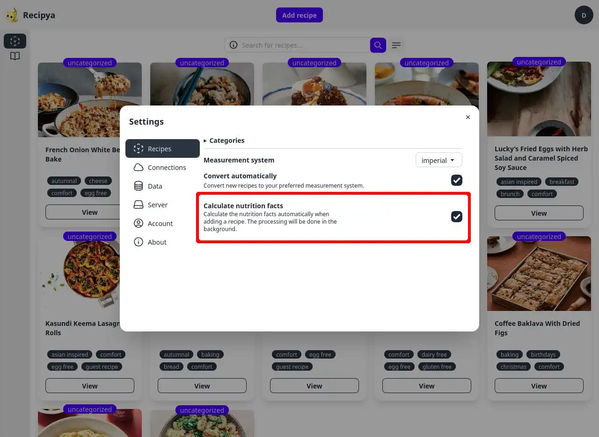

De nombreuses recettes manquent d’informations nutritionnelles et les utilisateurs peuvent ne pas vouloir calculer eux-mêmes. Pour résoudre ce problème,
Recipya peut calculer automatiquement les informations nutritionnelles pour vous lors de l'ajout d'une recette.

Pour activer cette fonctionnalité, accédez à la boîte de dialogue des paramètres depuis l'avatar, cliquez sur l'onglet `Recipes` à gauche et
cochez la case du paramètre **Calculate nutrition facts**.

Ce paramètre est initialement désactivé, car l'ajout d'une recette peut prendre jusqu'à quelques secondes supplémentaires. Cela se produit, car
l'interrogation de la base de données nutritionnelles pour chaque ingrédient prend du temps. Le traitement est effectué en arrière-plan
pour garantir que votre interaction avec l'application ne soit pas interrompue.

Recipya fait de son mieux pour calculer les informations nutritionnelles en fonction des ingrédients d'une recette. Cependant, veuillez
comprendre que le calcul est plus indicatif qu'absolu. Les informations sont basées sur le [FoodData Central](https://fdc.nal.usda.gov) du département
de l'agriculture des États-Unis, qui est un système de données intégré qui fournit des données de profil nutritionnel étendues. Veuillez [ouvrir un problème](https://github.com/reaper47/recipya/issues/new?assignees=&labels=bug&projects=&template=bug_report.md&title=Problem+with+nutrition+facts)
sur GitHub si jamais vous remarquez une recette avec des informations nutritionnelles qui semblent très inexactes.


Le calcul ne peut être effectué qu'avec des ingrédients écrits en anglais, car la base de données est uniquement en anglais.

