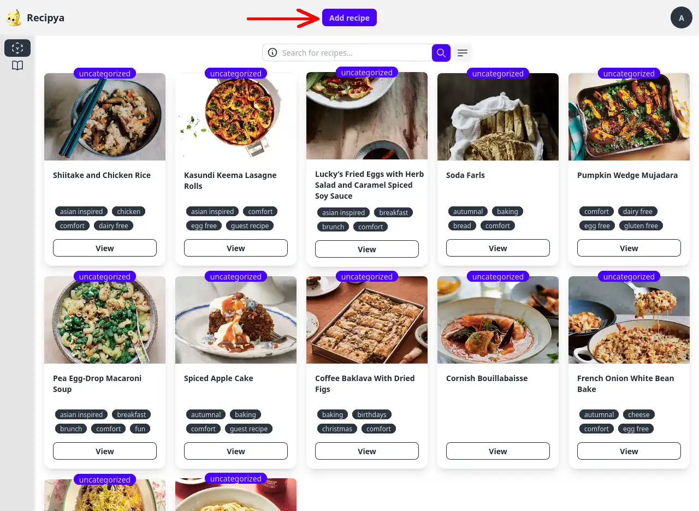
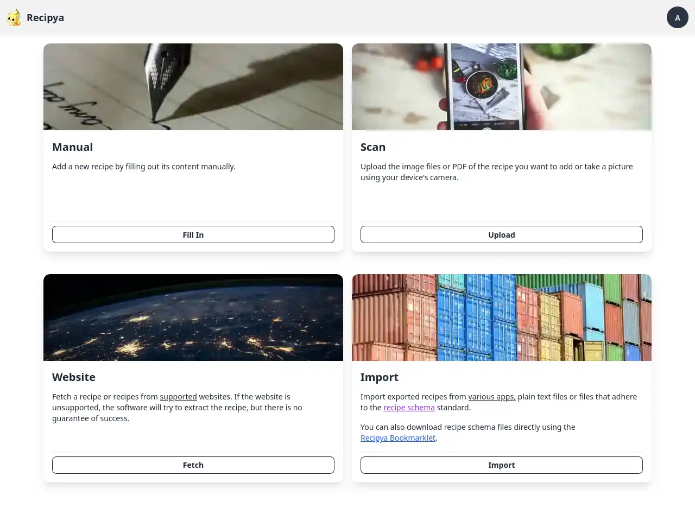
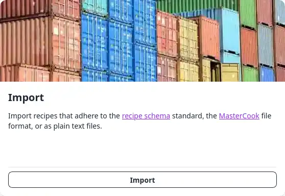

Vous pouvez ajouter une recette en cliquant sur le bouton bleu **Ajouter une recette** au milieu de la barre d'application.

## Ajout de recettes

Quatre façons différentes d’ajouter une recette à votre collection vous seront présentées.

- [Manuellement](#manuellement)
- [Scan](#scan)
- [Site Web](#site-web)
- [Importer](#importer)

### Manuellement

La méthode la plus simple pour saisir une recette consiste à remplir un formulaire décrivant votre plat.

Les champs suivants, indiqués par un astérisque (*), sont obligatoires :
- Titre
- Ingrédients
- Instructions

Les valeurs par défaut des champs vides après la soumission sont les suivantes :
- Média → Image de sushi par défaut
- Catégorie → « non catégorisé »
- Portions → 1
- Source → « Inconnu »
- Mots-clés → aucun
- Temps → 15 min (préparation), 30 min (cuisson)
- Description → vide
- Outils → aucun

Ces raccourcis pourraient vous être utiles si vous remplissez le formulaire depuis votre ordinateur.

| Raccourci     | Comment activer                              | Résultat                         |
|---------------|----------------------------------------------|----------------------------------|
| Entrée        | Focus sur la saisie de texte d'un ingrédient | Ajouter une ligne d'ingrédients  |
| Ctrl + Entrée | Focus sur une zone de texte d'instruction    | Ajouter une ligne d'instructions |

Vous pouvez également réorganiser les ingrédients et les instructions en faisant glisser la flèche verticalement.

### Scan

Vous pouvez télécharger une image ou un scan d'une recette manuscrite ou imprimée pour l'ajouter à votre collection.
Cette option est utile pour numériser vos recettes papier et celles de votre famille.

Pour ce faire, cliquez sur le bouton *Télécharger* et sélectionnez un document sur votre ordinateur.

Vous pouvez télécharger des fichiers dans les formats suivants :
- Images (JPEG/JPG, PNG, BMP, HEIF)
- PDF
- TIFF


Vous devez disposer d’une instance [Azure AI Document Intelligence](/guide/fr/docs/installation/integrations#azure-AI Document Intelligence) pour utiliser cette fonctionnalité.


### Site Web

Vous pouvez importer n'importe quelle recette à partir des sites Web pris en charge. Pour ce faire, cliquez sur le bouton **Récupérer**,
collez l'URL ou les URL de la recette, chacune sur une nouvelle ligne, et cliquez sur *Envoyer*. Une notification
apparaîtra lorsque l'opération sera terminée.

Son bouton d'action exécute une action en fonction du résultat. Lorsque vous avez importé une URL et que
l'opération réussit, l'action vous redirige vers la recette. Sinon, vous serez redirigé
vers le dernier rapport.

Pour afficher tous les sites Web pris en charge, veuillez cliquer sur le mot <ins>supported</ins>. Vous pouvez extraire un
site Web qui ne figure pas dans la liste prise en charge, mais l'extraction de la recette peut échouer. Veuillez ouvrir un problème sur GitHub si
c'est le cas.

### Importer

Vous pouvez importer des recettes dans les formats suivants :
- `.json` : si elles sont conformes à la norme [Recipe schema](https://schema.org/Recipe)
- `.mxp` : recettes exportées depuis [MasterCook](https://www.mastercook.com)
- `.paprikarecipes` : recettes exportées depuis [Paprika](https://www.paprikaapp.com) dans le format `Paprika Recipe Format`
- `.txt`
- `.zip`

Vous pouvez télécharger un fichier unique ou une archive zip contenant plusieurs recettes. Les recettes d'un fichier zip peuvent être
organisées par dossier. Chaque dossier peut contenir le fichier `.json` de la recette. Tous les autres fichiers d'un dossier
seront ignorés pendant le traitement.

Vous pouvez également télécharger des recettes exportées à partir des applications suivantes :
- AccuChef
- ChefTap
- Crouton
- Easy Recipe Deluxe
- Kalorio
- MasterCook
- Paprika
- Recipe Keeper
- RecipeSage
- Saffron

Veuillez vous référer à la [page des intégrations](/guide/fr/docs/features/integrations/) pour obtenir des instructions spécifiques à l'application.

#### Bookmarklet de Recipya

Le bookmarklet Recipya permet à un utilisateur d'exécuter un extrait JavaScript à partir de son navigateur qui extrait une recette d'une page Web.

Il est destiné aux sites Web qui à la fois :
- ne peuvent pas être récupérés via une requête serveur, c'est-à-dire qui ont quelque chose comme un captcha ou une détection de bot
- qui ont des extraits de script de recette json+ld sur leur page

Pour obtenir le bookmarklet :
1. Accédez à `/recipes/add`
2. Ajoutez le lien `Recipya Bookmarklet` à vos favoris dans la carte `Import`.

Pour l'utiliser :
1. Ouvrez une page Web de recette, par exemple [double banana nut bread](https://www.allrecipes.com/recipe/231961/double-banana-nut-bread/)
2. Cliquez sur le bookmarklet
3. Un fichier JSON est téléchargé lorsqu'il réussit.

Vous pouvez ensuite importer la recette extraite depuis `Ajouter une recette -> Importer`.

