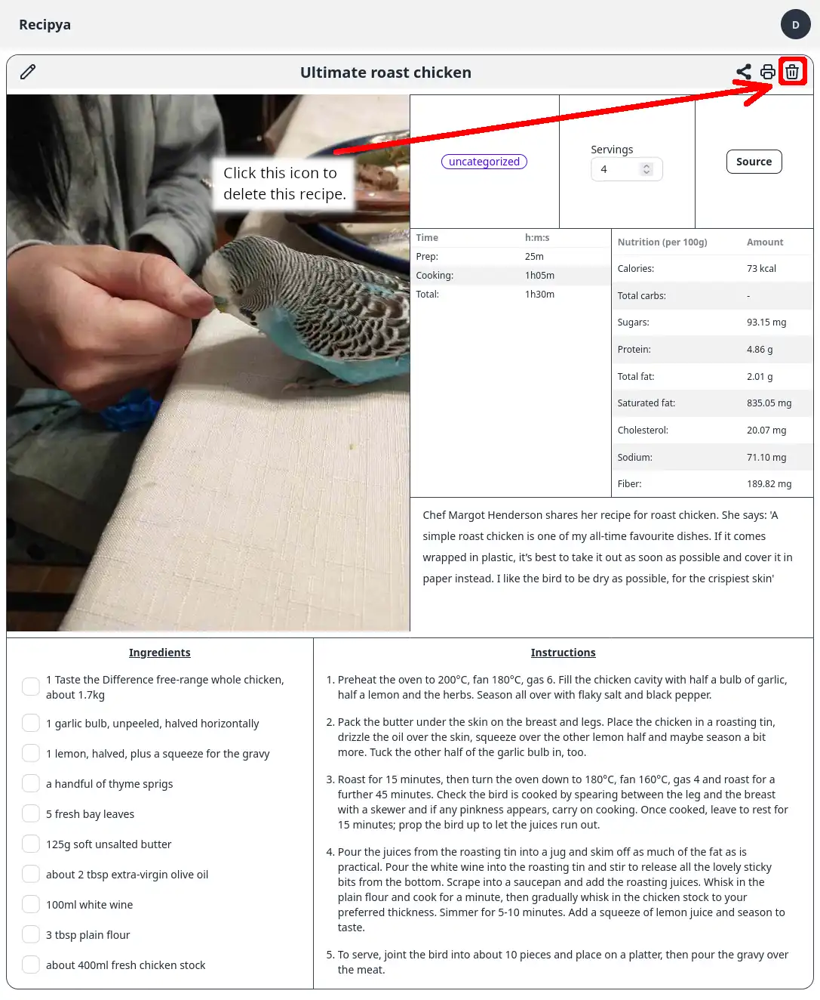

Pour supprimer une recette de votre collection, vous devez d'abord [afficher](/guide/fr/docs/features/recipes/view) 
une recette. Cliquez ensuite sur l'icône de la corbeille à droite du titre de la recette. Il vous sera demandé si
vous souhaitez continuer avant la suppression.


La suppression d'une recette est irréversible. Elle disparaîtra définitivement.

