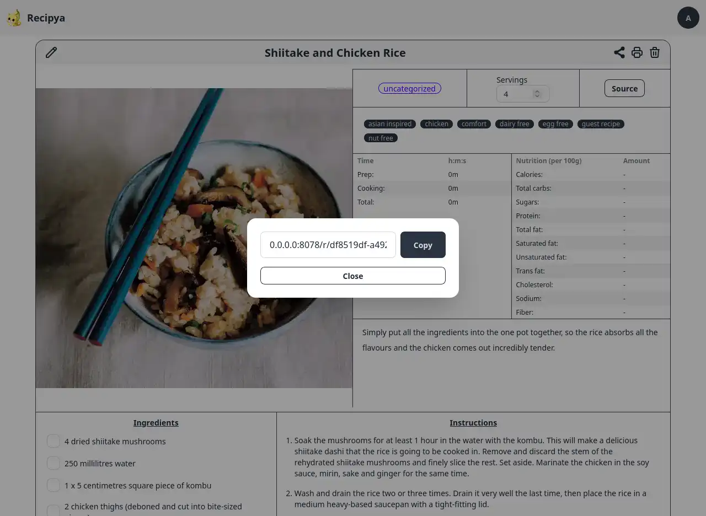

Une recette peut être partagée avec toute personne disposant du lien de partage.

Pour générer le lien, vous devez d'abord [afficher une recette](/guide/fr/docs/features/recipes/view). 
Ensuite, cliquez sur l'icône de partage à droite du titre de la recette.

Le lien sera généré et affiché pour que vous puissiez le copier, prêt à être envoyé à vos amis.
Sa convention de nommage est `{host}/r/{UUID}`. L'UUID empêchera tout conflit avec la recette partagée
de quelqu'un d'autre, car aucun UUID n'est identique.

