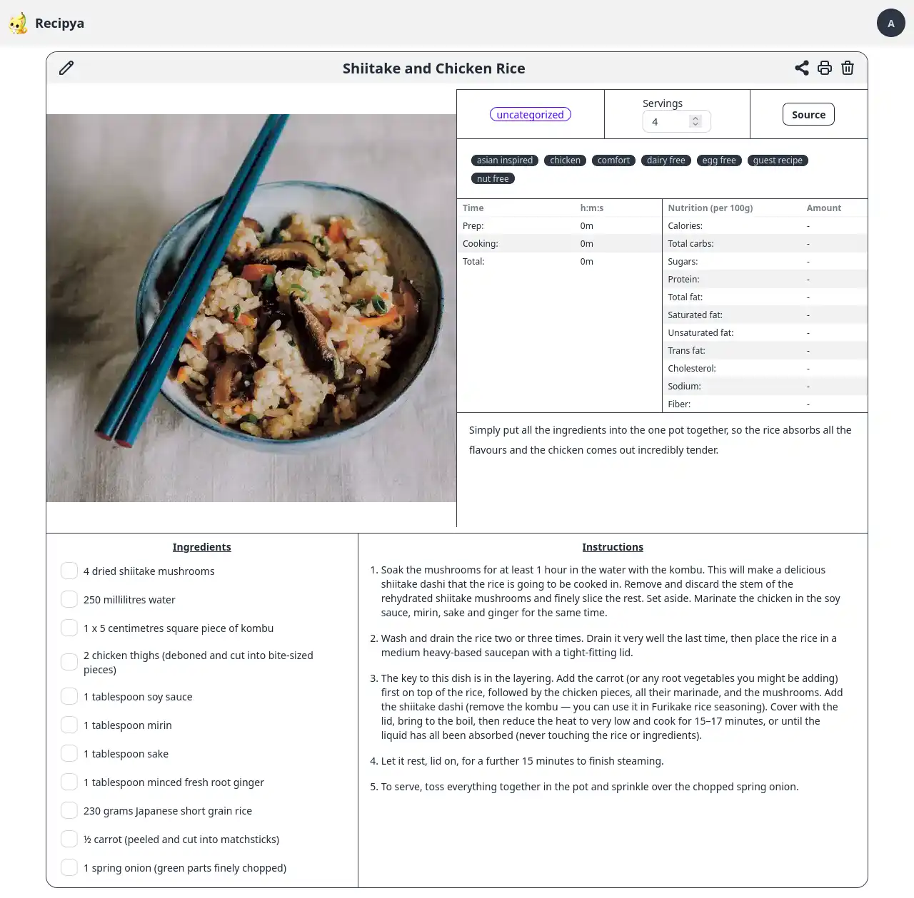
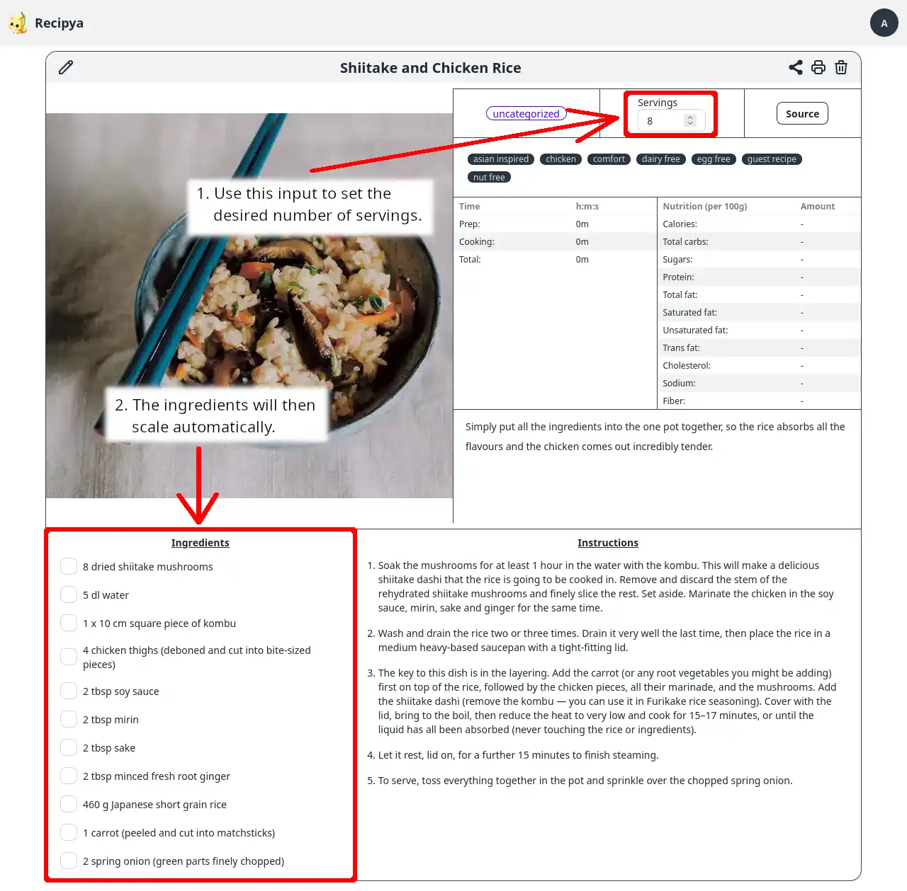

Pour visualiser une recette, vous devez d’abord cliquer sur le bouton « Afficher » ou sur l’image d’une recette sous votre collection de recettes.

Les informations de la recette vous seront ensuite présentées afin que vous puissiez les suivre pendant la cuisson.


Vous pouvez cliquer ou appuyer sur les ingrédients et les instructions pour les rayer.


## Mise à l'échelle

Pour adapter une recette, utilisez le nombre saisi dans le carré de rendement pour sélectionner le nombre de portions que vous souhaitez préparer.

Si vous souhaitez préparer plus de portions, saisissez un nombre plus élevé.
Si vous souhaitez en préparer moins, saisissez un nombre plus faible.

Par exemple, la recette ci-dessus donne 4 portions. Pour doubler la recette, définissez le nombre de portions à 8.
La recette sera alors automatiquement adaptée pour préparer 8 portions de shiitake et de riz au poulet, comme indiqué ci-dessous.


La fonction de mise à l'échelle ne met actuellement à l'échelle que les ingrédients, laissant les instructions intactes. Cela
signifie que si une instruction mentionne une quantité spécifique d'un ingrédient, cette quantité ne sera pas mise à l'échelle.
Cette limitation sera abordée à l'avenir.


## Vidéos

Il est possible de joindre des vidéos aux recettes. Chaque vidéo sera convertie au format de fichier multimédia audiovisuel
[WebM](https://en.wikipedia.org/wiki/WebM) à l'aide de [FFmpeg](https://en.wikipedia.org/wiki/FFmpeg).

FFmpeg est inclus dans la version Docker.

Sinon :
- Si vous utilisez Windows, le programme d'installation tentera de l'installer à l'aide de [winget](https://learn.microsoft.com/en-us/windows/package-manager/winget/).
- Si vous utilisez Linux, vous devez l'installer vous-même en exécutant la commande appropriée pour votre distribution.
- Si vous utilisez macOS, vous devez l'installer vous-même en exécutant `brew install ffmpeg`.

La conversion vidéo peut être lente. Par conséquent, la vidéo peut ne pas être immédiatement disponible pour la visualisation après l'avoir jointe à une recette.

Les recettes des sites Web incluent parfois des vidéos, par exemple [celle-ci](https://www.allrecipes.com/recipe/10813/best-chocolate-chip-cookies/).
Elles seront extraites automatiquement et seront affichées dans le carrousel d'images. Elles ne sont pas téléchargées localement ni
converties en WebM à l'aide de FFmpeg. Ils sont conservés dans leur format d'origine.
