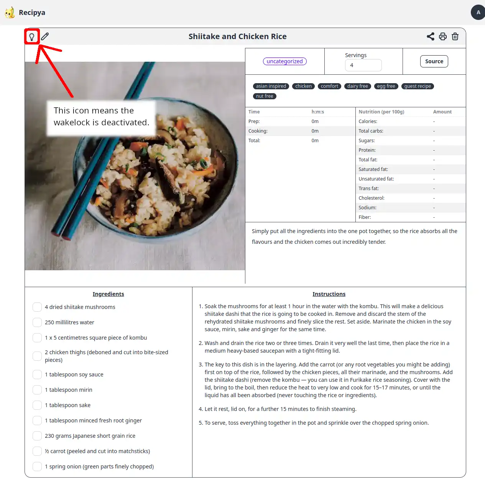

Imaginez que vous préparez une recette à partir d'un appareil mobile. Vous rassemblez tous les ingrédients et vous êtes prêt à commencer,
mais votre appareil se met en veille. Vous déverrouillez votre appareil et commencez à vous salir les mains dans la farine. Votre appareil
s'endort à nouveau. Vous vous lavez les mains, déverrouillez votre téléphone et continuez la recette. Votre appareil se met
en veille à nouveau. Vous êtes frustré. Ce processus se répète encore et encore. Votre appareil est sale et votre nourriture aussi.

Vous ne voulez pas que l'appareil se mette en veille pendant que vous cuisinez.

Recipya résout ce problème en fournissant un wakelock du navigateur lors de la visualisation d'une recette, empêchant ainsi l'appareil
de se mettre en veille.


Le wakelock est activé automatiquement lors de la visualisation d'une recette.


Sur les navigateurs pris en charge, vous remarquerez une icône d'ampoule à l'extrême gauche du titre d'une recette. Lorsque l'ampoule
est allumée, le wakelock est activé et l'écran ne se met pas en veille.

Lorsqu'il est désactivé, le wakelock est désactivé et l'écran finira par se mettre en veille.

