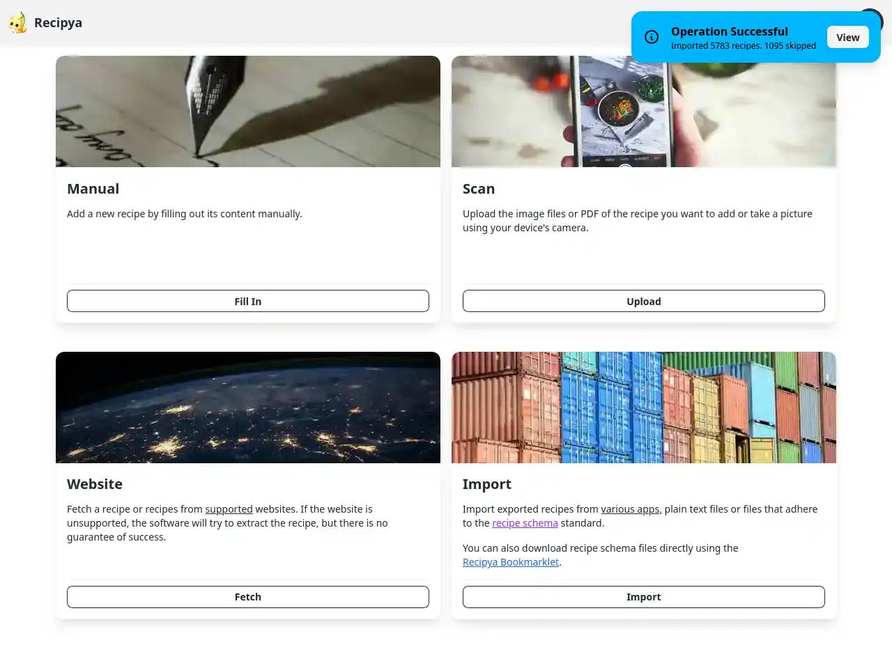

La page des rapports vous permet de visualiser les journaux d'opérations après l'importation de recettes.

## Accéder

Il existe deux façons d'accéder à la page.

### Menu avatar

La page des rapports répertorie tous les rapports dans le volet de gauche. Aucun rapport ne sera sélectionné initialement.

### Après les importations

La page des rapports répertorie également tous les rapports dans le volet de gauche. Le rapport le plus récent sera sélectionné.

## Structure

La page des rapports est structurée en deux volets d'affichage. Celui de gauche répertorie tous les rapports disponibles pour le
type de rapport, tandis que le volet de droite affiche le contenu du rapport sélectionné. Le type de rapport est sélectionné dans la 
barre latérale à côté de la liste des rapports.

Vous pouvez choisir parmi les types suivants :
- **Importation** : un rapport d'importation est un rapport généré après l'importation de recettes.
- 
### Volet gauche

Le volet de gauche répertorie tous les rapports du type sélectionné. Chaque élément affiche les informations suivantes :
- **Time stamp** : le titre de l'élément. Indique le moment où le rapport a été généré.
- **Execution time** : le temps nécessaire à l'importation des recettes.
- **Log count** : situé à droite de l'heure d'exécution. Indique le nombre d'entrées associées au rapport.

### Volet droit

Le volet de droite affiche toutes les entrées de journal associées au rapport sélectionné dans un tableau. Vous pouvez trier n'importe quelle colonne, par ordre décroissant ou
croissant, en cliquant sur son en-tête.

Les opérations ayant échoué seront surlignées en rouge.

