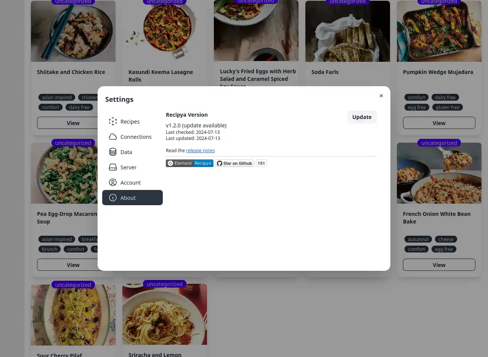
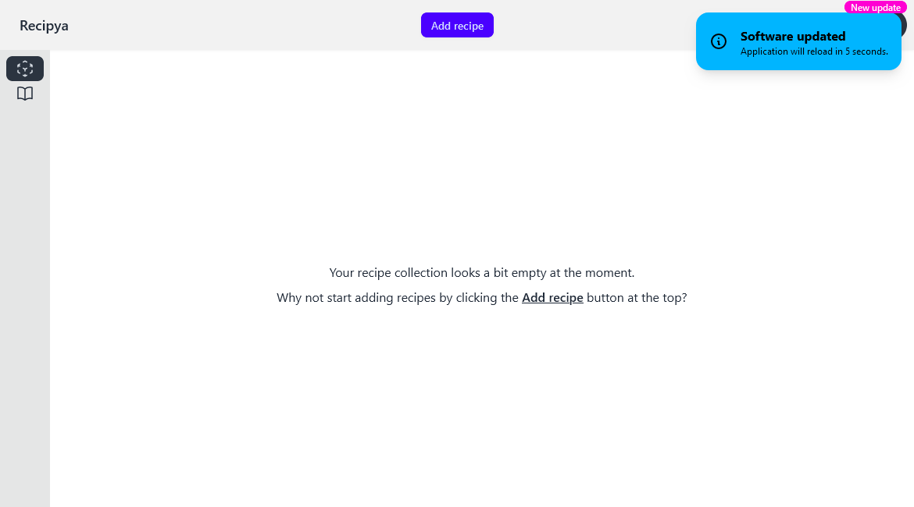

Vous pouvez mettre à jour l'application depuis l'application Web dès qu'une mise à jour est disponible. Vos données seront préalablement sauvegardées
sous `/path/to/recipya/Backup/global` au cas où quelque chose tourne mal. Le vérificateur de mise à jour est exécuté une fois tous les trois jours.

Vous remarquerez d'abord un badge rose `New update` sur votre avatar.

Cliquez sur votre avatar, accédez à la boîte de dialogue des paramètres et sélectionnez l'onglet
`About`. Enfin, cliquez sur le bouton `Update`.

En cas de succès, l'application se rechargera automatiquement après cinq secondes.

